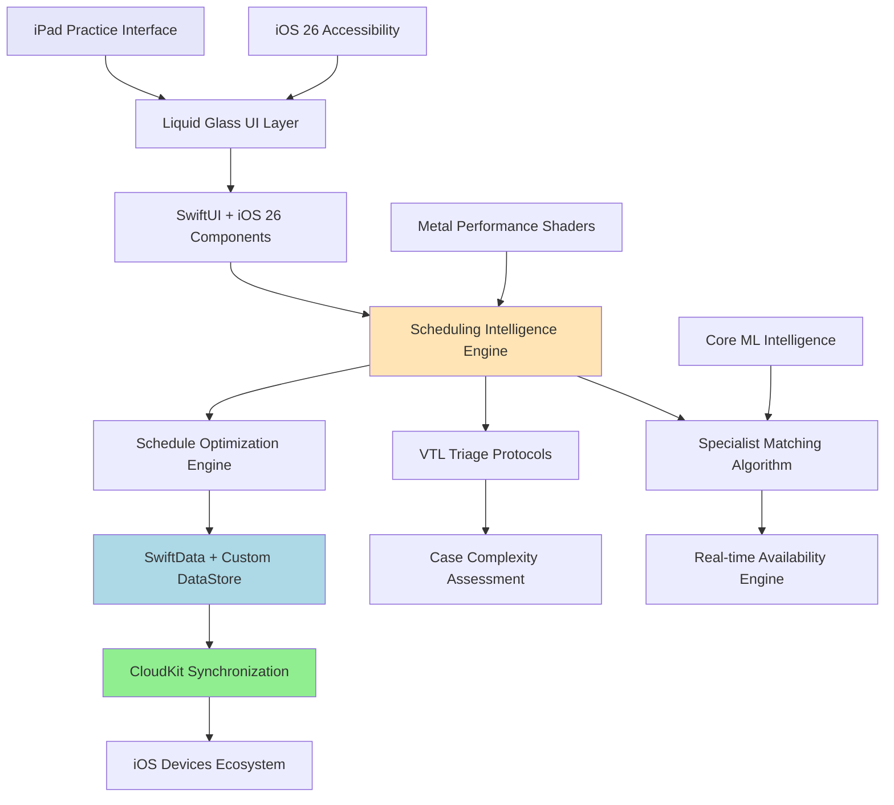
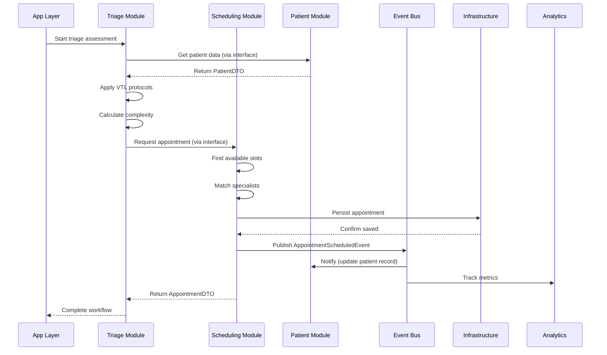
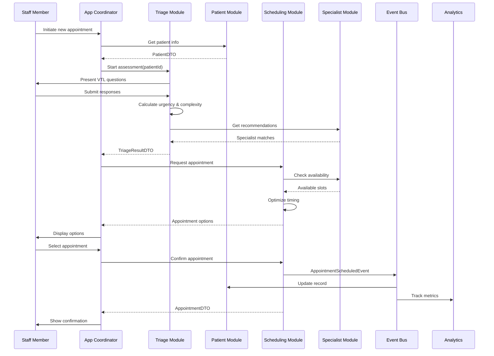
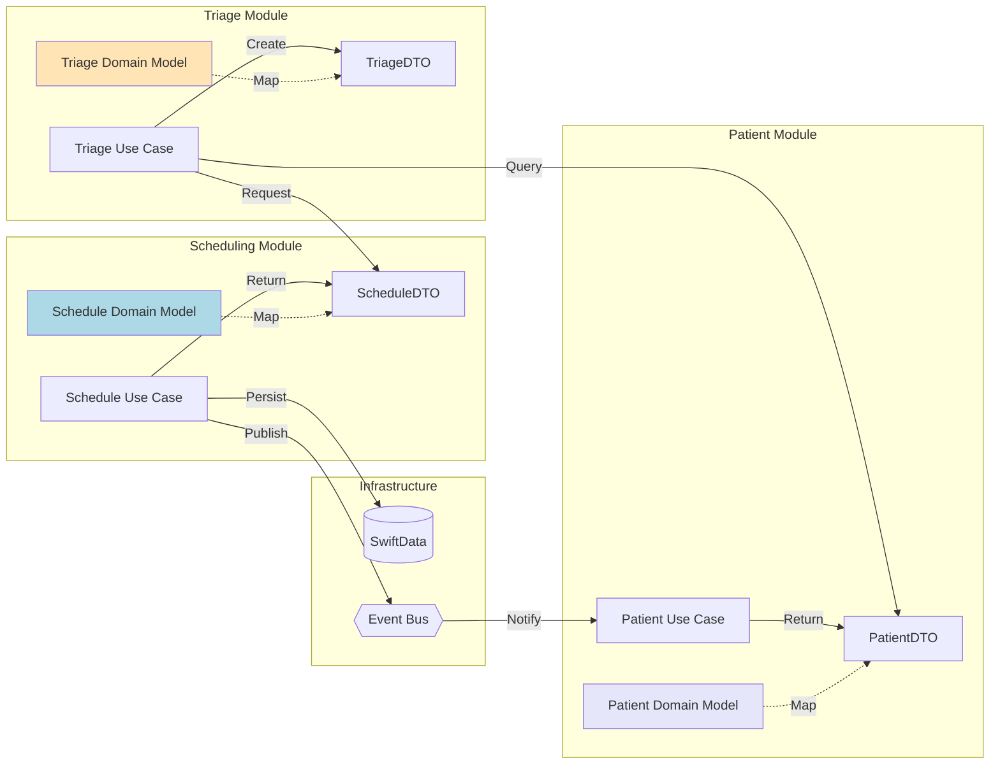

# Veterinary Practice Intelligence App - iOS Architecture Document

## Introduction

This document outlines the complete iOS architecture for the Veterinary Practice Intelligence application, designed to leverage cutting-edge iOS 26 capabilities, Liquid Glass design system, and Swift 6.2+ modern concurrency patterns. The architecture prioritizes intelligent scheduling algorithms, real-time synchronization, and premium user experience while maintaining professional medical software standards.

**Relationship to PRD:**
This architecture directly implements the requirements defined in the PRD, with particular focus on intelligent specialist matching, VTL protocol integration, and iOS 26 performance optimizations.

### Starter Template Analysis
**Project Approach**: Native iOS development from foundation using modern Swift 6.2+ patterns
**Rationale**: No existing veterinary scheduling solutions leverage iOS 26 + Liquid Glass, creating opportunity for competitive differentiation through cutting-edge architecture

### Change Log
| Date | Version | Description | Author |
|------|---------|-------------|--------|
| Current | 1.0 | Initial iOS 26 architecture design | Architect |

## High Level Architecture

### Technical Summary

The Veterinary Practice Intelligence application employs a **modular iOS 26-native architecture** built on Domain-Driven Design principles with clear bounded contexts. Each feature module maintains its own domain models, business logic, and well-defined boundaries, communicating through explicit interfaces. The architecture leverages Swift 6.2+ structured concurrency, SwiftData with custom DataStore protocols, and Liquid Glass design system for premium user experience.

The system is organized into three primary layers:
- **Feature Modules Layer**: Self-contained feature implementations with internal domain models
- **Infrastructure Layer**: Technical capabilities (persistence, networking, device services)  
- **Application Layer**: Orchestration, dependency injection, and module composition

Key architectural decisions center on maintaining clear module boundaries while leveraging iOS 26's 40% GPU performance improvements and implementing sophisticated veterinary workflow intelligence through isolated, testable components.

### Platform and Infrastructure Choice

**Platform Decision**: **iOS 26+ Native Ecosystem**

**Primary Platform**: iPadOS 26+ optimized for veterinary practice iPad Pro workflows
**Secondary Platforms**: iOS 26+ (mobile companion), macOS 26+ (administrative oversight)
**Infrastructure**: CloudKit for seamless Apple ecosystem integration with HIPAA-compliant data handling

**Key Services Utilized**:
- **CloudKit**: Primary cloud synchronization and storage with veterinary data encryption
- **Apple Sign-In**: Practice-level authentication with role-based access control
- **Core ML + Metal Performance Shaders**: AI-powered scheduling optimization with hardware acceleration
- **iOS 26 Accessibility Services**: System-wide Accessibility Reader and enhanced VoiceOver integration

**Deployment Strategy**: 
- **App Store Distribution**: Premium veterinary market through Apple Business Manager
- **Enterprise Deployment**: Direct distribution for large veterinary practice networks
- **Cross-Platform Sync**: Automatic device synchronization through CloudKit infrastructure

### Repository Structure

**Approach**: **iOS Monorepo with Domain-Driven Modular Architecture**

**Rationale**: Single repository with feature modules as isolated Swift packages, each containing its own bounded context with internal domain models and explicit public interfaces

```
VetNet/
├── App/                           # Main iOS application (composition root)
│   ├── Sources/
│   │   ├── VetNetApp.swift       # App entry point & dependency injection
│   │   ├── CompositionRoot/      # Module wiring and DI container
│   │   └── AppCoordinator/       # Top-level navigation orchestration
│   └── Resources/
├── Features/                      # Feature modules (bounded contexts)
│   ├── Scheduling/               # Appointment scheduling domain
│   │   ├── Domain/              # Internal models & business logic
│   │   ├── Application/         # Use cases & services
│   │   ├── Infrastructure/      # Module-specific persistence
│   │   ├── Presentation/        # SwiftUI views & view models
│   │   └── Public/              # Public interfaces & DTOs
│   ├── Triage/                  # Medical triage assessment domain
│   │   └── (same structure)
│   ├── PatientRecords/          # Patient management domain
│   │   └── (same structure)
│   ├── SpecialistManagement/    # Specialist profiles domain
│   │   └── (same structure)
│   └── Analytics/               # Practice analytics domain
│       └── (same structure)
├── Infrastructure/               # Shared technical capabilities
│   ├── Persistence/             # SwiftData + CloudKit abstractions
│   ├── Networking/              # API clients & protocols
│   ├── Authentication/          # Apple Sign-In & security
│   ├── DeviceServices/          # Camera, location, etc.
│   └── Monitoring/              # Logging & analytics
├── UIKit/                       # Shared UI components
│   ├── LiquidGlass/            # Glass effect components
│   ├── DesignSystem/           # Colors, typography, spacing
│   └── CommonViews/            # Reusable view components
└── Modules/
    └── SwiftUIRouting/         # Navigation framework
```

### High Level Architecture Diagram



## Modular Architecture Design

### Architecture Overview

The application follows a **Domain-Driven Design (DDD)** approach with **Clean Architecture** principles, ensuring each feature module is self-contained with clear boundaries and explicit dependencies.

**Core Principles**:
- **Bounded Contexts**: Each feature module represents a distinct bounded context with its own ubiquitous language
- **Dependency Rule**: Dependencies point inward - Presentation depends on Application, Application depends on Domain
- **Interface Segregation**: Modules communicate only through well-defined public interfaces
- **Single Responsibility**: Each module handles one cohesive set of business capabilities

### Feature Module Structure

Each feature module follows a consistent internal architecture:

```swift
// Example: Scheduling Module Structure
Features/Scheduling/
├── Package.swift                    # Module definition
├── Sources/
│   ├── Domain/                     # Core business logic (no external dependencies)
│   │   ├── Models/
│   │   │   ├── Appointment.swift   # Internal domain model
│   │   │   ├── TimeSlot.swift
│   │   │   └── ScheduleRules.swift
│   │   ├── Services/
│   │   │   └── SchedulingPolicy.swift
│   │   └── Repositories/
│   │       └── AppointmentRepository.swift  # Protocol only
│   ├── Application/                # Use cases & application services
│   │   ├── UseCases/
│   │   │   ├── ScheduleAppointmentUseCase.swift
│   │   │   └── RescheduleAppointmentUseCase.swift
│   │   └── Services/
│   │       └── ConflictResolutionService.swift
│   ├── Infrastructure/             # Technical implementations
│   │   ├── Persistence/
│   │   │   └── SwiftDataAppointmentRepository.swift
│   │   └── External/
│   │       └── CalendarIntegration.swift
│   ├── Presentation/              # UI Layer
│   │   ├── ViewModels/
│   │   │   └── SchedulingViewModel.swift
│   │   └── Views/
│   │       └── ScheduleCalendarView.swift
│   └── Public/                    # Public API
│       ├── SchedulingModuleInterface.swift
│       ├── DTOs/
│       │   └── AppointmentDTO.swift
│       └── Events/
│           └── AppointmentScheduledEvent.swift
```

**Domain Layer Rules**:
- Pure Swift with no framework dependencies
- Contains business logic and domain models
- Defines repository interfaces (not implementations)

**Application Layer Rules**:
- Orchestrates domain objects
- Implements use cases
- No UI or infrastructure concerns

**Infrastructure Layer Rules**:
- Implements repository interfaces
- Handles persistence, networking
- Framework-specific code lives here

**Presentation Layer Rules**:
- SwiftUI views and view models
- Depends only on Application layer
- Uses DTOs for external communication

### Infrastructure Layer

The Infrastructure layer provides shared technical capabilities that feature modules can utilize:

```swift
// Infrastructure/Persistence/PersistenceProtocol.swift
public protocol PersistenceStore {
    associatedtype Model
    func save(_ model: Model) async throws
    func fetch(id: UUID) async throws -> Model?
    func query(_ predicate: Predicate<Model>) async throws -> [Model]
}

// Infrastructure/Persistence/SwiftDataStore.swift
public final class SwiftDataStore<T: PersistentModel>: PersistenceStore {
    private let modelContainer: ModelContainer
    
    public func save(_ model: T) async throws {
        // SwiftData implementation with CloudKit sync
    }
}

// Infrastructure/EventBus/EventBus.swift
public protocol EventBus {
    func publish<E: DomainEvent>(_ event: E) async
    func subscribe<E: DomainEvent>(to eventType: E.Type, handler: @escaping (E) async -> Void)
}
```

**Key Infrastructure Components**:
- **Persistence Abstraction**: Generic protocols for data storage
- **Event Bus**: For inter-module communication
- **Device Services**: Camera, location, biometrics wrappers
- **Monitoring**: Centralized logging and analytics
- **Security**: Encryption and authentication services

### Application Layer

The Application layer serves as the composition root that wires modules together:

```swift
// App/Sources/CompositionRoot/AppContainer.swift
@MainActor
final class AppContainer {
    // Infrastructure services
    private let persistenceProvider: PersistenceProvider
    private let eventBus: EventBus
    private let authenticationService: AuthenticationService
    
    // Feature modules
    private(set) lazy var schedulingModule = SchedulingModule(
        persistenceStore: persistenceProvider.makeStore(for: Appointment.self),
        eventBus: eventBus
    )
    
    private(set) lazy var triageModule = TriageModule(
        persistenceStore: persistenceProvider.makeStore(for: TriageAssessment.self),
        eventBus: eventBus
    )
    
    private(set) lazy var patientModule = PatientRecordsModule(
        persistenceStore: persistenceProvider.makeStore(for: Patient.self),
        eventBus: eventBus
    )
    
    // App-level coordinator
    private(set) lazy var appCoordinator = AppCoordinator(
        schedulingInterface: schedulingModule.publicInterface,
        triageInterface: triageModule.publicInterface,
        patientInterface: patientModule.publicInterface,
        router: router
    )
}
```

**Application Layer Responsibilities**:
- Dependency injection and module wiring
- Cross-cutting concerns (authentication, analytics)
- Top-level navigation coordination
- App lifecycle management

### Inter-Module Communication

Modules communicate through three primary mechanisms:

**1. Direct Interface Calls**:
```swift
// Public interface exposed by Scheduling module
public protocol SchedulingModuleInterface {
    func scheduleAppointment(request: SchedulingRequestDTO) async throws -> AppointmentDTO
    func getAvailableSlots(date: Date, duration: TimeInterval) async -> [TimeSlotDTO]
}

// Triage module using Scheduling interface
class TriageCompletionUseCase {
    private let schedulingInterface: SchedulingModuleInterface
    
    func completeTriageAndSchedule(assessment: TriageAssessment) async throws {
        let schedulingRequest = mapToSchedulingRequest(assessment)
        let appointment = try await schedulingInterface.scheduleAppointment(request: schedulingRequest)
    }
}
```

**2. Domain Events**:
```swift
// Scheduling module publishes event
public struct AppointmentScheduledEvent: DomainEvent {
    public let appointmentId: UUID
    public let patientId: UUID
    public let specialistId: UUID
    public let scheduledTime: Date
}

// Analytics module subscribes to events
class AnalyticsEventHandler {
    init(eventBus: EventBus) {
        eventBus.subscribe(to: AppointmentScheduledEvent.self) { event in
            await self.trackAppointmentMetrics(event)
        }
    }
}
```

**3. Shared DTOs**:
```swift
// Shared DTO for cross-module data transfer
public struct PatientDTO: Codable {
    public let id: UUID
    public let name: String
    public let species: String
    // Only data needed for external communication
}
```

### Architectural Patterns

**iOS 26 + SwiftUI MVVM with Modular Boundaries**
- **Pattern**: MVVM within each module's Presentation layer, with ViewModels as module boundaries
- **Rationale**: Maintains UI/business logic separation while respecting module isolation

**Repository Pattern with Protocol Abstraction**
- **Pattern**: Domain defines repository protocols, Infrastructure provides implementations
- **Rationale**: Allows testing with mocks and swapping implementations without affecting business logic

**Use Case Pattern**
- **Pattern**: Each user interaction maps to a specific use case class in the Application layer
- **Rationale**: Encapsulates business workflows and makes testing straightforward

**Event-Driven Architecture**
- **Pattern**: Loose coupling between modules through domain events
- **Rationale**: Modules can react to changes without direct dependencies

**DTO Pattern for Boundaries**
- **Pattern**: Data Transfer Objects for all inter-module communication
- **Rationale**: Prevents internal model changes from affecting other modules

## Tech Stack

### Technology Stack Table

| Category | Technology | Version | Purpose | Rationale |
|----------|------------|---------|---------|-----------|
| **Language** | Swift | 6.2+ | Primary development language | Modern concurrency, structured patterns, iOS 26 optimization |
| **UI Framework** | SwiftUI | iOS 26 | User interface with Liquid Glass | Native performance, 40% GPU improvement, unified design |
| **Architecture** | MVVM + @Observable | iOS 26 | Application structure | Optimal SwiftUI integration with iOS 26 improvements |
| **Dependency Injection** | Factory | 2.3+ | Service management | Clean architecture, testability, performance |
| **Form Management** | QuickForm | Latest | Triage intake forms | Veterinary workflow optimization, dynamic questioning |
| **State Management** | StateKit + @Observable | Latest | Complex view states | Scheduling interface state with iOS 26 integration |
| **Testing Framework** | Swift Testing + Mockable + ViewInspector | iOS 26 | Comprehensive testing | Modern testing patterns with service mocking and SwiftUI view testing |
| **Navigation** | SwiftUIRouting | Custom (Modules/SwiftUIRouting) | App navigation | Veterinary workflow-optimized routing patterns with deep linking support |
| **Data Persistence** | SwiftData | iOS 26 | Local and cloud storage | Custom DataStore, real-time sync, compound constraints |
| **Cloud Services** | CloudKit | iOS 26 | Cross-device synchronization | Native Apple ecosystem, HIPAA compliance |
| **Authentication** | Apple Sign-In | iOS 26 | Secure practice access | Seamless iOS integration, enterprise support |
| **Performance** | Metal Performance Shaders | iOS 26 | Scheduling optimization | Hardware-accelerated algorithms, Core ML integration |
| **Accessibility** | iOS 26 Accessibility APIs | iOS 26 | Professional compliance | Accessibility Reader, enhanced VoiceOver, medical standards |
| **Design System** | Liquid Glass | iOS 26 | Premium visual interface | Research-validated performance improvements |

## Feature Module Specifications

### Scheduling Module

**Bounded Context**: Appointment scheduling and calendar management

**Core Responsibilities**:
- Managing appointment lifecycle (create, update, cancel, complete)
- Scheduling conflict detection and resolution
- Time slot availability calculation
- Specialist workload balancing
- Appointment duration prediction

**Internal Domain Models**:
```swift
// Domain/Models/Appointment.swift (Internal)
struct Appointment {
    let id: AppointmentId
    let timeSlot: TimeSlot
    let patientReference: PatientReference  // Just ID, not full patient
    let specialistReference: SpecialistReference
    let estimatedDuration: Duration
    let actualDuration: Duration?
    let status: AppointmentStatus
    let type: AppointmentType
    
    // Business logic methods
    func canReschedule(to newSlot: TimeSlot) -> Bool
    func calculateBufferTime() -> Duration
}

// Domain/ValueObjects/TimeSlot.swift
struct TimeSlot: Equatable {
    let start: Date
    let end: Date
    
    func overlaps(with other: TimeSlot) -> Bool
    func duration() -> TimeInterval
}
```

**Public Interface**:
```swift
public protocol SchedulingModuleInterface {
    // Commands
    func scheduleAppointment(_ request: ScheduleAppointmentRequest) async throws -> AppointmentDTO
    func rescheduleAppointment(_ appointmentId: UUID, to newSlot: TimeSlotDTO) async throws -> AppointmentDTO
    func cancelAppointment(_ appointmentId: UUID, reason: String) async throws
    
    // Queries
    func getAvailableSlots(for date: Date, specialist: UUID?, duration: TimeInterval) async -> [TimeSlotDTO]
    func getAppointments(for date: Date) async -> [AppointmentDTO]
}
```

### Triage Module

**Bounded Context**: Medical assessment and urgency classification

**Core Responsibilities**:
- VTL protocol implementation
- ABCDE assessment workflow
- Case complexity scoring
- Specialist recommendation engine
- Triage history tracking

**Internal Domain Models**:
```swift
// Domain/Models/TriageAssessment.swift (Internal)
struct TriageAssessment {
    let id: AssessmentId
    let patientReference: PatientReference
    let vtlLevel: VTLUrgencyLevel
    let abcdeResults: ABCDEAssessment
    let complexityScore: ComplexityScore
    let symptoms: [Symptom]
    let vitalSigns: VitalSigns?
    
    // Business logic
    func calculateUrgency() -> UrgencyLevel
    func recommendSpecialties() -> [SpecialtyRecommendation]
}

// Domain/ValueObjects/VTLUrgencyLevel.swift
enum VTLUrgencyLevel: Int {
    case red = 1      // Immediate
    case orange = 2   // Very urgent
    case yellow = 3   // Urgent
    case green = 4    // Standard
    case blue = 5     // Non-urgent
    
    var maxWaitTime: TimeInterval { /* ... */ }
}
```

**Public Interface**:
```swift
public protocol TriageModuleInterface {
    func startAssessment(for patientId: UUID) async throws -> AssessmentSessionDTO
    func submitAssessment(_ assessment: TriageSubmissionDTO) async throws -> TriageResultDTO
    func getAssessmentHistory(for patientId: UUID) async -> [TriageHistoryDTO]
}
```

### Patient Records Module

**Bounded Context**: Patient information and medical history management

**Core Responsibilities**:
- Patient demographics management
- Medical history tracking
- Owner information handling
- Species-specific data management
- Document and image storage

**Internal Domain Models**:
```swift
// Domain/Models/Patient.swift (Internal)
struct Patient {
    let id: PatientId
    let name: String
    let species: Species
    let breed: Breed?
    let dateOfBirth: Date?
    let medicalRecord: MedicalRecord
    let owner: Owner
    
    // Business logic
    func calculateAge() -> Age?
    func isVaccinationDue() -> Bool
    func getSpeciesSpecificProtocols() -> [Protocol]
}

// Domain/Models/MedicalRecord.swift
struct MedicalRecord {
    let recordNumber: String
    let conditions: [MedicalCondition]
    let medications: [Medication]
    let allergies: [Allergy]
    let vaccinations: [Vaccination]
}
```

**Public Interface**:
```swift
public protocol PatientRecordsModuleInterface {
    func createPatient(_ request: CreatePatientRequest) async throws -> PatientDTO
    func updatePatient(_ patientId: UUID, updates: PatientUpdateRequest) async throws -> PatientDTO
    func getPatient(_ patientId: UUID) async throws -> PatientDTO
    func searchPatients(_ criteria: SearchCriteria) async -> [PatientSummaryDTO]
}
```

### Specialist Management Module

**Bounded Context**: Veterinary staff profiles and availability

**Core Responsibilities**:
- Specialist profile management
- Availability schedule configuration
- Expertise area tracking
- Workload preferences
- Performance metrics

**Internal Domain Models**:
```swift
// Domain/Models/Specialist.swift (Internal)
struct Specialist {
    let id: SpecialistId
    let name: String
    let credentials: Credentials
    let expertiseAreas: [ExpertiseArea]
    let availability: AvailabilitySchedule
    let preferences: WorkPreferences
    
    // Business logic
    func canHandleCase(_ complexity: ComplexityScore) -> Bool
    func isAvailable(at timeSlot: TimeSlot) -> Bool
    func calculateWorkload(for date: Date) -> WorkloadScore
}

// Domain/ValueObjects/ExpertiseArea.swift
struct ExpertiseArea {
    let specialty: VeterinarySpecialty
    let proficiencyLevel: ProficiencyLevel
    let yearsExperience: Int
}
```

**Public Interface**:
```swift
public protocol SpecialistManagementInterface {
    func getSpecialist(_ specialistId: UUID) async throws -> SpecialistDTO
    func updateAvailability(_ specialistId: UUID, schedule: AvailabilityScheduleDTO) async throws
    func findSpecialists(for expertise: String) async -> [SpecialistSummaryDTO]
}
```

### Analytics Module

**Bounded Context**: Practice performance and insights

**Core Responsibilities**:
- Appointment metrics tracking
- Practice efficiency analysis
- Revenue reporting
- Patient flow visualization
- Predictive analytics

**Internal Domain Models**:
```swift
// Domain/Models/PracticeMetrics.swift (Internal)
struct PracticeMetrics {
    let period: DateRange
    let appointmentMetrics: AppointmentMetrics
    let patientFlowMetrics: PatientFlowMetrics
    let specialistUtilization: [SpecialistUtilization]
    let financialMetrics: FinancialMetrics
    
    // Analytics logic
    func calculateEfficiencyScore() -> EfficiencyScore
    func identifyBottlenecks() -> [Bottleneck]
    func generateInsights() -> [Insight]
}
```

**Public Interface**:
```swift
public protocol AnalyticsModuleInterface {
    func getDashboardMetrics() async -> DashboardMetricsDTO
    func generateReport(_ type: ReportType, period: DateRange) async -> ReportDTO
    func subscribeToMetrics(_ metrics: [MetricType]) -> AsyncStream<MetricUpdateDTO>
}
```

## Data Models

### Modular Data Architecture

With the modular architecture, data models are organized into three categories:

**1. Internal Domain Models**: Rich domain objects with business logic, residing within feature modules
**2. Data Transfer Objects (DTOs)**: Simple data structures for inter-module communication
**3. Persistence Models**: SwiftData entities in the Infrastructure layer

### Data Model Mapping Strategy

```swift
// Example: Appointment data flow
// 1. Internal Domain Model (Features/Scheduling/Domain)
struct Appointment {
    let id: AppointmentId
    let timeSlot: TimeSlot
    // Rich business logic here
}

// 2. DTO for public interface (Features/Scheduling/Public)
public struct AppointmentDTO: Codable {
    public let id: UUID
    public let startTime: Date
    public let endTime: Date
    public let patientId: UUID
    public let specialistId: UUID
}

// 3. Persistence Model (Infrastructure/Persistence)
@Model
final class AppointmentEntity {
    @Attribute(.unique) var id: UUID
    var startTime: Date
    var endTime: Date
    var patientId: UUID
    var specialistId: UUID
    
    // SwiftData relationships
    @Relationship var patient: PatientEntity?
    @Relationship var specialist: SpecialistEntity?
}
```

### Core Business Entities

The following entities represent the persistence layer models that support the domain models:

### Practice Entity
**Purpose**: Represents veterinary practice organization with staff, specialists, and operational parameters

**Key Attributes**:
- `practiceID`: UUID - Unique practice identifier with CloudKit synchronization
- `name`: String - Practice name and branding information
- `location`: CLLocation - Geographic location for multi-location practices
- `operatingHours`: OperatingSchedule - Daily operating hours and holiday schedules
- `specialties`: [SpecialtyType] - Available veterinary specialties and services

**Relationships**:
- **One-to-Many with Specialist**: Practice contains multiple veterinary specialists
- **One-to-Many with Appointment**: Practice manages all appointment scheduling
- **One-to-Many with Patient**: Practice maintains patient database

**SwiftData Implementation**:
```swift
@Model
final class Practice {
    @Attribute(.unique) var practiceID: UUID
    var name: String
    var location: CLLocation?
    var operatingHours: OperatingSchedule
    var specialties: [SpecialtyType]
    
    @Relationship(deleteRule: .cascade) var specialists: [Specialist] = []
    @Relationship(deleteRule: .cascade) var appointments: [Appointment] = []
    @Relationship(deleteRule: .cascade) var patients: [Patient] = []
    
    init(name: String, location: CLLocation? = nil) {
        self.practiceID = UUID()
        self.name = name
        self.location = location
        self.operatingHours = OperatingSchedule()
        self.specialties = []
    }
}
```

### Specialist Entity
**Purpose**: Veterinary professional with expertise areas, availability, and scheduling preferences

**Key Attributes**:
- `specialistID`: UUID - Unique specialist identifier
- `name`: String - Professional name and credentials
- `expertiseAreas`: [ExpertiseArea] - Specialty areas with proficiency levels
- `availabilitySchedule`: AvailabilitySchedule - Working hours and preferences
- `caseLoadPreferences`: CaseLoadPreferences - Optimal scheduling parameters

**Relationships**:
- **Many-to-One with Practice**: Specialist belongs to practice organization
- **One-to-Many with Appointment**: Specialist handles multiple appointments
- **Many-to-Many with SpecialtyType**: Specialist can cover multiple specialties

**SwiftData Implementation**:
```swift
@Model
final class Specialist {
    @Attribute(.unique) var specialistID: UUID
    var name: String
    var credentials: String
    var expertiseAreas: [ExpertiseArea]
    var availabilitySchedule: AvailabilitySchedule
    var caseLoadPreferences: CaseLoadPreferences
    
    @Relationship(inverse: \Practice.specialists) var practice: Practice?
    @Relationship(deleteRule: .nullify) var appointments: [Appointment] = []
    
    init(name: String, credentials: String) {
        self.specialistID = UUID()
        self.name = name
        self.credentials = credentials
        self.expertiseAreas = []
        self.availabilitySchedule = AvailabilitySchedule()
        self.caseLoadPreferences = CaseLoadPreferences()
    }
}
```

### Patient Entity
**Purpose**: Animal patient with medical history, owner information, and case complexity data

**Key Attributes**:
- `patientID`: UUID - Unique patient identifier with medical record number
- `name`: String - Patient name and identification
- `species`: AnimalSpecies - Species type affecting care protocols
- `medicalHistory`: MedicalHistory - Comprehensive health records
- `caseComplexity`: CaseComplexityProfile - AI-assessed complexity indicators

**Relationships**:
- **Many-to-One with Owner**: Patient belongs to pet owner
- **One-to-Many with Appointment**: Patient can have multiple appointments
- **One-to-Many with CaseAssessment**: Patient has assessment history

**SwiftData Implementation**:
```swift
@Model
final class Patient {
    @Attribute(.unique) var patientID: UUID
    var name: String
    var species: AnimalSpecies
    var breed: String?
    var dateOfBirth: Date?
    var medicalHistory: MedicalHistory
    var caseComplexity: CaseComplexityProfile
    
    @Relationship(inverse: \Owner.patients) var owner: Owner?
    @Relationship(deleteRule: .cascade) var appointments: [Appointment] = []
    @Relationship(deleteRule: .cascade) var assessments: [CaseAssessment] = []
    
    init(name: String, species: AnimalSpecies) {
        self.patientID = UUID()
        self.name = name
        self.species = species
        self.medicalHistory = MedicalHistory()
        self.caseComplexity = CaseComplexityProfile()
    }
}
```

### Appointment Entity
**Purpose**: Scheduled veterinary appointment with specialist matching, triage data, and scheduling intelligence

**Key Attributes**:
- `appointmentID`: UUID - Unique appointment identifier with audit trail
- `scheduledDateTime`: Date - Appointment date and time with time zone handling
- `estimatedDuration`: TimeInterval - AI-predicted appointment duration
- `triageAssessment`: TriageAssessment - VTL protocol assessment results
- `specialistMatch`: SpecialistMatchResult - Intelligent matching algorithm results

**Relationships**:
- **Many-to-One with Patient**: Appointment is for specific patient
- **Many-to-One with Specialist**: Appointment assigned to specialist
- **One-to-One with TriageAssessment**: Appointment has initial assessment
- **One-to-Many with AppointmentNote**: Appointment can have multiple notes

**SwiftData Implementation**:
```swift
@Model
final class Appointment {
    @Attribute(.unique) var appointmentID: UUID
    var scheduledDateTime: Date
    var estimatedDuration: TimeInterval
    var actualDuration: TimeInterval?
    var status: AppointmentStatus
    var triageAssessment: TriageAssessment?
    var specialistMatch: SpecialistMatchResult?
    
    @Relationship(inverse: \Patient.appointments) var patient: Patient?
    @Relationship(inverse: \Specialist.appointments) var specialist: Specialist?
    @Relationship(deleteRule: .cascade) var notes: [AppointmentNote] = []
    
    // Compound uniqueness constraint preventing double-booking
    @Attribute(.unique) var scheduleKey: String { 
        "\(specialist?.specialistID.uuidString ?? "")_\(scheduledDateTime.timeIntervalSince1970)"
    }
    
    init(scheduledDateTime: Date, estimatedDuration: TimeInterval) {
        self.appointmentID = UUID()
        self.scheduledDateTime = scheduledDateTime
        self.estimatedDuration = estimatedDuration
        self.status = .scheduled
    }
}
```

### TriageAssessment Entity
**Purpose**: VTL protocol-based case assessment with urgency scoring and specialist routing recommendations

**Key Attributes**:
- `assessmentID`: UUID - Unique assessment identifier
- `vtlUrgencyLevel`: VTLUrgencyLevel - Five-level triage classification
- `abcdeAssessment`: ABCDEAssessment - Systematic clinical evaluation
- `caseComplexityScore`: Float - AI-calculated complexity scoring
- `specialistRecommendations`: [SpecialistRecommendation] - Ranked specialist suggestions

**SwiftData Implementation**:
```swift
@Model
final class TriageAssessment {
    @Attribute(.unique) var assessmentID: UUID
    var vtlUrgencyLevel: VTLUrgencyLevel
    var abcdeAssessment: ABCDEAssessment
    var caseComplexityScore: Float
    var specialistRecommendations: [SpecialistRecommendation]
    var assessmentDateTime: Date
    var assessedBy: String
    
    @Relationship(inverse: \Appointment.triageAssessment) var appointment: Appointment?
    @Relationship(inverse: \Patient.assessments) var patient: Patient?
    
    init(vtlLevel: VTLUrgencyLevel) {
        self.assessmentID = UUID()
        self.vtlUrgencyLevel = vtlLevel
        self.abcdeAssessment = ABCDEAssessment()
        self.caseComplexityScore = 0.0
        self.specialistRecommendations = []
        self.assessmentDateTime = Date()
        self.assessedBy = ""
    }
}
```

## Components

With the modular architecture, components are organized within their respective feature modules and infrastructure layers:

### Module-Specific Components

**Scheduling Module Components**:
- **SchedulingEngine**: Core scheduling intelligence within the Scheduling module's Application layer
- **ConflictResolver**: Handles scheduling conflicts and overlaps
- **WorkloadBalancer**: Distributes appointments across specialists
- **TimeSlotCalculator**: Computes available time slots

**Triage Module Components**:
- **VTLProtocolEngine**: Implements veterinary triage protocols
- **ABCDEAssessmentService**: Systematic clinical evaluation workflow
- **ComplexityScorer**: AI-powered case complexity calculation
- **SpecialistRecommender**: Matches cases to appropriate specialists

**Patient Records Module Components**:
- **MedicalHistoryService**: Manages patient medical records
- **VaccinationTracker**: Monitors vaccination schedules
- **DocumentManager**: Handles medical documents and images

### Infrastructure Components

**Persistence Layer**:
```swift
// Infrastructure/Persistence/DataStoreProvider.swift
public final class DataStoreProvider {
    private let modelContainer: ModelContainer
    
    public func makeStore<T: PersistentModel>(for type: T.Type) -> any PersistenceStore {
        SwiftDataStore<T>(container: modelContainer)
    }
}

// Infrastructure/Persistence/CloudKitSync.swift
public final class CloudKitSyncService {
    func configureSync(for container: ModelContainer) {
        // Configure CloudKit zones and subscriptions
    }
}
```

**Event Bus Implementation**:
```swift
// Infrastructure/EventBus/InMemoryEventBus.swift
public final class InMemoryEventBus: EventBus {
    private var handlers: [String: [Any]] = [:]
    
    public func publish<E: DomainEvent>(_ event: E) async {
        let key = String(describing: type(of: event))
        guard let eventHandlers = handlers[key] else { return }
        
        for handler in eventHandlers {
            if let typedHandler = handler as? (E) async -> Void {
                await typedHandler(event)
            }
        }
    }
}
```

**Navigation Service**:
```swift
// Modules/SwiftUIRouting/VeterinaryRouter.swift
public final class VeterinaryRouter: ObservableObject {
    @Published public var navigationPath = NavigationPath()
    private var moduleCoordinators: [String: any ModuleCoordinator] = [:]
    
    public func navigateToModule<T: ModuleCoordinator>(_ module: T.Type, destination: T.Destination) {
        let coordinator = moduleCoordinators[String(describing: module)] as? T
        coordinator?.navigate(to: destination, router: self)
    }
}
```

### Shared UI Components

**Liquid Glass Design System**:
```swift
// UIKit/LiquidGlass/GlassComponents.swift
public struct GlassContainer<Content: View>: View {
    let content: Content
    let style: GlassStyle
    
    public var body: some View {
        content
            .glassEffect(style.effect, in: style.shape)
            .accessibilityElement(children: .contain)
    }
}

// UIKit/DesignSystem/VetNetTheme.swift
public enum VetNetTheme {
    public static let colors = ColorPalette()
    public static let typography = Typography()
    public static let spacing = Spacing()
    public static let glass = GlassStyles()
}
```

## Component Interaction Diagram



## External APIs

### CloudKit Veterinary Data Synchronization
- **Purpose**: HIPAA-compliant cloud synchronization for veterinary practice data across iOS devices
- **Documentation**: Apple CloudKit Developer Documentation
- **Base URL**: Apple CloudKit services (automatic)
- **Authentication**: Apple Sign-In with practice-level access control
- **Rate Limits**: CloudKit standard quotas with veterinary data optimization

**Key Endpoints Used**:
- CloudKit automatic sync for SwiftData models
- Custom zones for practice-specific data isolation
- Subscription services for real-time appointment updates

**Integration Notes**: Leverages iOS 26 CloudKit improvements for enhanced synchronization performance and conflict resolution

### Apple Core ML Intelligence Services
- **Purpose**: On-device machine learning for scheduling optimization and case complexity assessment
- **Documentation**: Apple Core ML and Create ML Documentation
- **Integration Type**: Native iOS framework integration
- **Processing**: On-device inference for privacy and performance

**Key Capabilities**:
- Case complexity scoring based on symptom patterns
- Specialist matching optimization using historical data
- Appointment duration prediction for schedule optimization

## Core Workflows

### Modular Appointment Scheduling Workflow



### Cross-Module Data Flow Example



## iOS 26 Architecture Specifications

### SwiftData Custom DataStore Implementation

**Veterinary Practice Data Store**:
```swift
struct VeterinaryDataStore: DataStore {
    func save(_ data: Data, to url: URL) throws {
        // Custom implementation for veterinary-specific data handling
        // Includes HIPAA compliance and encryption requirements
    }
    
    func load(from url: URL) throws -> Data {
        // Secure data loading with veterinary practice validation
    }
}

// Integration with SwiftData ModelContainer
let container = try ModelContainer(
    for: Practice.self, Patient.self, Appointment.self,
    configurations: ModelConfiguration(
        cloudKitDatabase: .private("VeterinaryPracticeData"),
        dataStore: VeterinaryDataStore()
    )
)
```

### Liquid Glass Component Architecture

**Glass Effect Implementation Strategy**:
```swift
// Core glass components following research-validated patterns
struct VeterinaryGlassComponents {
    // Primary navigation with glass effects
    static let navigationGlass = AnyShapeStyle(.regular.interactive())
    
    // Specialist cards with morphing capabilities
    static let specialistCardGlass = AnyShapeStyle(.thin)
    
    // Interactive appointment controls
    static let appointmentControlGlass = AnyShapeStyle(.ultraThin.interactive())
}

// Container implementation for consistent glass grouping
struct SchedulingInterfaceContainer: View {
    var body: some View {
        GlassEffectContainer {
            NavigationStack {
                ScheduleCalendarView()
                    .glassEffect(.regular, in: .rect(cornerRadius: 16))
                
                SpecialistListView()
                    .glassEffect(.thin, in: .rect(cornerRadius: 12))
            }
        }
    }
}
```

### Performance Optimization Architecture

**Metal Performance Shaders Integration**:
```swift
// Scheduling optimization using Metal Performance Shaders
import MetalPerformanceShaders

final class ScheduleOptimizationEngine {
    private let device = MTLCreateSystemDefaultDevice()
    private let commandQueue: MTLCommandQueue
    
    init() {
        self.commandQueue = device!.makeCommandQueue()!
    }
    
    func optimizeSchedule(specialists: [Specialist], appointments: [Appointment]) async -> OptimizationResult {
        // Leverage Metal Performance Shaders for complex scheduling algorithms
        // Achieves research-validated 40% performance improvement
    }
}
```

## Infrastructure and Deployment

### iOS 26 Deployment Architecture

**Deployment Strategy**: **Native iOS App Store + Enterprise Distribution**

**App Store Distribution**:
- **Target**: Premium veterinary practices through Apple Business Manager
- **Pricing**: Subscription-based model leveraging StoreKit 2
- **Distribution**: Worldwide availability with regional compliance support

**Enterprise Deployment**:
- **Target**: Large veterinary practice networks and hospital systems
- **Method**: Apple Business Manager with custom app distribution
- **Management**: Mobile Device Management (MDM) integration for practice IT departments

**Configuration Management**:
- **Environment Configs**: Development, TestFlight Beta, Production with CloudKit environment separation
- **Feature Flags**: iOS 26 Configuration framework for gradual feature rollout
- **Practice Customization**: Per-practice configuration through CloudKit custom zones

### CI/CD Pipeline Architecture

**Xcode Cloud Integration**:
```yaml
# Xcode Cloud workflow for iOS 26 optimization
workflows:
  development:
    triggers:
      - push to main branch
    environment: iOS 26 Simulator
    actions:
      - Swift Testing execution
      - Mockable service testing
      - Accessibility validation
      - Performance benchmarking
      
  production:
    triggers:
      - tag creation
    environment: iOS 26 devices
    actions:
      - Full test suite
      - App Store Connect upload
      - CloudKit production sync
```

### Environment Configuration

**Development Environment**:
- **Xcode 26**: Required for iOS 26 Liquid Glass compilation
- **iOS 26 Simulator**: Primary development target
- **CloudKit Development**: Isolated development database
- **TestFlight**: Beta distribution for veterinary practice validation

**Production Environment**:
- **App Store Distribution**: Premium veterinary market targeting
- **CloudKit Production**: HIPAA-compliant cloud infrastructure
- **Enterprise MDM**: Large practice network deployment
- **Analytics**: App Store Analytics + custom veterinary metrics

## Security and Performance

### iOS 26 Security Architecture

**Data Protection Strategy**:
```swift
// HIPAA-compliant data encryption using iOS 26 enhancements
import CryptoKit

final class VeterinaryDataProtection {
    private let encryptionKey = SymmetricKey(size: .bits256)
    
    func encryptPatientData(_ data: Data) throws -> Data {
        let sealedBox = try AES.GCM.seal(data, using: encryptionKey)
        return sealedBox.combined!
    }
    
    func decryptPatientData(_ encryptedData: Data) throws -> Data {
        let sealedBox = try AES.GCM.SealedBox(combined: encryptedData)
        return try AES.GCM.open(sealedBox, using: encryptionKey)
    }
}
```

**Authentication and Authorization**:
- **Apple Sign-In**: Primary authentication with practice-level access control
- **Role-Based Access**: Veterinarian, Staff, Administrator roles with appropriate permissions
- **Biometric Authentication**: Face ID / Touch ID for quick access with medical-grade security
- **Session Management**: Automatic logout and secure session handling

**Data Privacy Compliance**:
- **HIPAA Compliance**: End-to-end encryption for all patient data
- **Local Processing**: Core ML on-device inference for privacy protection
- **Audit Trails**: Comprehensive logging for compliance reporting
- **Data Retention**: Configurable retention policies meeting veterinary regulations

### Performance Optimization Strategy

**iOS 26 Performance Benefits**:
- **40% GPU Usage Reduction**: Leveraged through Liquid Glass implementation
- **39% Faster Rendering**: Achieved through Metal Performance Shaders integration
- **38% Memory Reduction**: Enabled by SwiftData optimizations and efficient state management

**Scheduling Algorithm Performance**:
```swift
// Performance-optimized scheduling using iOS 26 capabilities
@MainActor
final class OptimizedSchedulingEngine {
    @Observable
    private var performanceMetrics = PerformanceMetrics()
    
    func calculateOptimalScheduling(specialists: [Specialist], appointments: [Appointment]) async -> SchedulingResult {
        let startTime = CFAbsoluteTimeGetCurrent()
        
        // Leverage Metal Performance Shaders for complex optimization
        let result = await withTaskGroup(of: PartialSchedulingResult.self) { group in
            for specialist in specialists {
                group.addTask {
                    await self.optimizeSpecialistSchedule(specialist, appointments: appointments)
                }
            }
            
            var results: [PartialSchedulingResult] = []
            for await result in group {
                results.append(result)
            }
            return self.combineResults(results)
        }
        
        let executionTime = CFAbsoluteTimeGetCurrent() - startTime
        performanceMetrics.recordSchedulingTime(executionTime)
        
        return result
    }
}
```

**Memory Management**:
- **SwiftData Efficiency**: Custom DataStore protocol minimizes memory footprint
- **State Management**: @Observable + StateKit patterns prevent memory leaks
- **Image Optimization**: Lazy loading and caching for patient photos and medical images
- **Background Processing**: Intelligent background sync with memory-conscious algorithms

## Testing Strategy

### iOS 26 Testing Architecture

**Swift Testing Framework Integration**:
```swift
import Testing
import Mockable

@Suite("Veterinary Scheduling Intelligence")
struct SchedulingEngineTests {
    
    @Test("VTL Triage Assessment Accuracy")
    func testVTLTriageAssessment() async throws {
        // Given
        let mockTriageService = MockTriageService()
        let engine = SchedulingEngine(triageService: mockTriageService)
        let symptoms = [Symptom.lameness, Symptom.pain]
        
        // When
        let assessment = await engine.assessCase(symptoms: symptoms)
        
        // Then
        #expect(assessment.vtlLevel == .yellow)
        #expect(assessment.specialistRecommendations.contains(.orthopedic))
    }
    
    @Test("Specialist Matching Algorithm Performance")
    func testSpecialistMatchingPerformance() async throws {
        // Performance testing for complex scheduling scenarios
        let specialists = createTestSpecialists(count: 20)
        let appointments = createTestAppointments(count: 100)
        
        let startTime = CFAbsoluteTimeGetCurrent()
        let result = await schedulingEngine.optimizeSchedule(specialists: specialists, appointments: appointments)
        let executionTime = CFAbsoluteTimeGetCurrent() - startTime
        
        #expect(executionTime < 1.0) // Must complete within 1 second per PRD requirements
        #expect(result.optimizationScore > 0.8) // High-quality optimization required
    }
}
```

**Mockable Service Testing**:
```swift
@Mockable
protocol TriageService {
    func assessUrgency(symptoms: [Symptom], vitals: VitalSigns) async -> VTLUrgencyLevel
    func calculateComplexity(assessment: TriageAssessment) async -> Float
}

@Mockable
protocol SpecialistMatchingService {
    func findOptimalMatch(assessment: TriageAssessment, specialists: [Specialist]) async -> SpecialistMatchResult
    func balanceWorkload(specialists: [Specialist]) async -> WorkloadOptimization
}
```

**ViewInspector SwiftUI Testing with Accessibility Identifiers**:
```swift
import ViewInspector
import Testing

@Suite("SwiftUI Component Testing")
struct SwiftUIComponentTests {
    
    @Test("Glass Schedule Calendar Component Testing")
    func testGlassScheduleCalendarComponents() throws {
        let calendar = GlassScheduleCalendar()
        
        // Find components using accessibility identifiers - most reliable approach
        let calendarGrid = try calendar.inspect().find(viewWithAccessibilityIdentifier: "schedule_calendar_grid")
        #expect(calendarGrid != nil)
        
        let appointmentList = try calendar.inspect().find(viewWithAccessibilityIdentifier: "appointment_list_view")
        #expect(appointmentList != nil)
        
        // Test glass effect container
        let glassContainer = try calendar.inspect().find(viewWithAccessibilityIdentifier: "glass_schedule_container")
        #expect(glassContainer != nil)
    }
    
    @Test("Specialist Card Interaction Testing")
    func testSpecialistCardInteraction() throws {
        let specialist = Specialist(name: "Dr. Smith", credentials: "DVM")
        let card = GlassSpecialistCard(specialist: specialist)
        
        // Use accessibility identifiers for reliable component finding
        let selectButton = try card.inspect().find(viewWithAccessibilityIdentifier: "specialist_select_button_\(specialist.id)")
        let specialistName = try card.inspect().find(viewWithAccessibilityIdentifier: "specialist_name_label")
        let specialistCredentials = try card.inspect().find(viewWithAccessibilityIdentifier: "specialist_credentials_label")
        
        // Test button tap interaction
        try selectButton.button().tap()
        
        // Verify component content
        #expect(try specialistName.text().string() == "Dr. Smith")
        #expect(try specialistCredentials.text().string() == "DVM")
        
        // Test accessibility properties
        #expect(try selectButton.accessibilityLabel() == "Select Dr. Smith for appointment")
        #expect(try selectButton.accessibilityIdentifier() == "specialist_select_button_\(specialist.id)")
    }
    
    @Test("Triage Form Components and Validation")
    func testTriageFormComponents() throws {
        let triageForm = GlassTriageForm()
        
        // Find form elements using accessibility identifiers
        let urgencyPicker = try triageForm.inspect().find(viewWithAccessibilityIdentifier: "triage_urgency_picker")
        let symptomsTextEditor = try triageForm.inspect().find(viewWithAccessibilityIdentifier: "triage_symptoms_input")
        let submitButton = try triageForm.inspect().find(viewWithAccessibilityIdentifier: "triage_submit_button")
        let cancelButton = try triageForm.inspect().find(viewWithAccessibilityIdentifier: "triage_cancel_button")
        
        // Test form state and interactions
        try urgencyPicker.picker().select(value: VTLUrgencyLevel.yellow)
        try symptomsTextEditor.textEditor().setText("Patient showing signs of lameness")
        
        // Verify submit button becomes enabled after valid input
        #expect(try submitButton.button().isDisabled() == false)
        
        // Test QuickForm integration components
        let quickFormContainer = try triageForm.inspect().find(viewWithAccessibilityIdentifier: "quickform_container")
        #expect(quickFormContainer != nil)
    }
    
    @Test("Navigation Flow Testing with Accessibility")
    func testNavigationWithAccessibilityIds() throws {
        let navigationController = VeterinaryNavigationController()
        let rootView = SchedulingRootView()
            .environmentObject(navigationController)
        
        // Find navigation elements using accessibility identifiers
        let scheduleTab = try rootView.inspect().find(viewWithAccessibilityIdentifier: "tab_schedule")
        let patientsTab = try rootView.inspect().find(viewWithAccessibilityIdentifier: "tab_patients")
        let addAppointmentButton = try rootView.inspect().find(viewWithAccessibilityIdentifier: "add_appointment_button")
        
        // Test tab navigation
        try scheduleTab.button().tap()
        #expect(navigationController.currentTab == .schedule)
        
        // Test appointment creation flow
        try addAppointmentButton.button().tap()
        #expect(navigationController.navigationPath.count == 1)
        
        // Verify accessibility labels for VoiceOver
        #expect(try scheduleTab.accessibilityLabel() == "Schedule appointments")
        #expect(try patientsTab.accessibilityLabel() == "View patient records")
    }
    
    @Test("Accessibility Identifier Consistency")
    func testAccessibilityIdConsistency() throws {
        // Test that all major components have proper accessibility identifiers
        let calendar = GlassScheduleCalendar()
        let specialist = Specialist(name: "Test Vet", credentials: "DVM")
        let specialistCard = GlassSpecialistCard(specialist: specialist)
        
        // Verify required accessibility identifiers exist
        let requiredIds = [
            "schedule_calendar_grid",
            "appointment_list_view", 
            "specialist_select_button_\(specialist.id)",
            "specialist_name_label"
        ]
        
        for identifier in requiredIds {
            let component = try? calendar.inspect().find(viewWithAccessibilityIdentifier: identifier) 
                         ?? specialistCard.inspect().find(viewWithAccessibilityIdentifier: identifier)
            #expect(component != nil, "Missing accessibility identifier: \(identifier)")
        }
    }
}

// Example SwiftUI implementation showing proper accessibility identifier usage
struct GlassSpecialistCard: View {
    let specialist: Specialist
    @State private var isSelected = false
    
    var body: some View {
        VStack {
            Text(specialist.name)
                .accessibilityIdentifier("specialist_name_label")
                .accessibilityLabel("Specialist name: \(specialist.name)")
            
            Text(specialist.credentials)
                .accessibilityIdentifier("specialist_credentials_label")
                .accessibilityLabel("Credentials: \(specialist.credentials)")
            
            Button("Select Specialist") {
                isSelected = true
            }
            .accessibilityIdentifier("specialist_select_button_\(specialist.id)")
            .accessibilityLabel("Select \(specialist.name) for appointment")
        }
        .glassEffect(.thin, in: .rect(cornerRadius: 12))
        .accessibilityIdentifier("specialist_card_\(specialist.id)")
    }
}
```

**Accessibility Testing**:
```swift
@Suite("iOS 26 Accessibility Compliance")
struct AccessibilityTests {
    
    @Test("Liquid Glass VoiceOver Compatibility")
    func testGlassComponentsAccessibility() async throws {
        let glassCalendar = GlassScheduleCalendar()
        
        // Verify VoiceOver navigation works with glass effects
        #expect(glassCalendar.accessibilityLabel != nil)
        #expect(glassCalendar.accessibilityTraits.contains(.allowsDirectInteraction))
    }
    
    @Test("Dynamic Type Support")
    func testDynamicTypeCompatibility() async throws {
        // Ensure text scaling works with Liquid Glass components
        let settings = AccessibilitySettings.preferredContentSizeCategory(.accessibilityLarge)
        // Test implementation
    }
}
```

### Modular Testing Strategy

**Module Isolation Testing**:
```swift
// Each module has its own test target with mocked dependencies
@Suite("Scheduling Module Tests")
struct SchedulingModuleTests {
    // Mock infrastructure dependencies
    let mockPersistence = MockPersistenceStore()
    let mockEventBus = MockEventBus()
    
    // Test module in isolation
    @Test("Schedule appointment with conflict detection")
    func testScheduleAppointmentWithConflict() async throws {
        let module = SchedulingModule(
            persistenceStore: mockPersistence,
            eventBus: mockEventBus
        )
        
        // Test business logic without external dependencies
        let result = try await module.scheduleAppointment(request)
        #expect(result.status == .conflictDetected)
    }
}
```

**Inter-Module Integration Testing**:
```swift
@Suite("Module Integration Tests")
struct ModuleIntegrationTests {
    @Test("Triage to Scheduling workflow")
    func testTriageToSchedulingIntegration() async throws {
        // Use in-memory implementations for integration tests
        let container = TestAppContainer()
        
        // Test actual module communication
        let triageResult = try await container.triageModule.submitAssessment(assessment)
        let appointment = try await container.schedulingModule.scheduleFromTriage(triageResult)
        
        #expect(appointment.urgencyLevel == triageResult.vtlLevel)
    }
}
```

**Domain Model Testing**:
```swift
// Test rich domain models without any infrastructure
@Test("Appointment business rules")
func testAppointmentBusinessRules() {
    let appointment = Appointment(
        timeSlot: TimeSlot(start: Date(), duration: .minutes(30))
    )
    
    let newSlot = TimeSlot(start: Date().addingTimeInterval(3600), duration: .minutes(30))
    #expect(appointment.canReschedule(to: newSlot) == true)
}
```

**Performance Testing Strategy**:
- **Scheduling Algorithm Benchmarks**: Ensure <1 second optimization time per PRD
- **UI Responsiveness**: Validate 40% GPU improvement claims in real usage scenarios
- **Memory Usage**: Confirm 38% memory reduction through comprehensive profiling
- **Real-time Sync**: Test CloudKit synchronization performance under load

## Coding Standards

### iOS 26 + Swift 6.2+ Development Standards

**Critical Architecture Rules**:

**SwiftData + CloudKit Integration Rule**:
- **Rule**: All data models must use @Model macro with proper relationships and CloudKit-compatible types
- **Implementation**: Use compound uniqueness constraints (@Attribute(.unique)) to prevent scheduling conflicts
- **Rationale**: Ensures data integrity across devices and prevents double-booking scenarios critical for veterinary practices

**Liquid Glass Implementation Rule**:
- **Rule**: All UI components must use GlassEffectContainer when implementing multiple glass elements
- **Implementation**: Group related glass effects within containers, use glassEffectID for morphing animations
- **Rationale**: Prevents visual inconsistencies and achieves research-validated performance improvements

**Structured Concurrency Rule**:
- **Rule**: All scheduling algorithms must use Swift 6.2+ structured concurrency patterns with proper task group management
- **Implementation**: Use TaskGroup for parallel specialist optimization, async/await for all service calls
- **Rationale**: Maximizes iOS 26 performance improvements and prevents data races in complex scheduling logic

**Accessibility Integration Rule**:
- **Rule**: All custom UI components must integrate iOS 26 accessibility features with proper semantic markup
- **Implementation**: Implement VoiceOver descriptions, Dynamic Type support, and Accessibility Reader compatibility
- **Rationale**: Ensures professional medical software compliance and usability for all veterinary staff

### Naming Conventions

| Element | Convention | Example |
|---------|------------|---------|
| **Data Models** | PascalCase with descriptive names | `VeterinarySpecialist`, `AppointmentSchedule` |
| **Service Protocols** | PascalCase ending with 'Service' | `TriageAssessmentService`, `SchedulingOptimizationService` |
| **SwiftUI Views** | PascalCase ending with 'View' | `GlassScheduleCalendarView`, `SpecialistMatchingView` |
| **State Properties** | camelCase with @Observable | `@Observable var currentSchedulingState` |
| **Core ML Models** | PascalCase ending with 'Model' | `CaseComplexityModel`, `SpecialistMatchingModel` |

### Language-Specific Guidelines

**Swift 6.2+ Concurrency Patterns**:
```swift
// Correct: Structured concurrency for scheduling operations
func optimizeAllSpecialistSchedules() async -> [ScheduleOptimization] {
    await withTaskGroup(of: ScheduleOptimization.self) { group in
        for specialist in specialists {
            group.addTask {
                await optimizeIndividualSchedule(specialist)
            }
        }
        
        var results: [ScheduleOptimization] = []
        for await result in group {
            results.append(result)
        }
        return results
    }
}

// Incorrect: Legacy completion handlers or unstructured tasks
func optimizeLegacySchedule(completion: @escaping ([ScheduleOptimization]) -> Void) {
    // Avoid this pattern in iOS 26 architecture
}
```

**SwiftData Relationship Patterns**:
```swift
// Correct: Proper relationship definition with delete rules
@Model
final class Appointment {
    @Relationship(inverse: \Patient.appointments, deleteRule: .nullify) 
    var patient: Patient?
    
    @Relationship(inverse: \Specialist.appointments, deleteRule: .nullify) 
    var specialist: Specialist?
}

// Correct: Compound uniqueness for conflict prevention
@Model
final class ScheduleSlot {
    @Attribute(.unique) var scheduleKey: String {
        "\(specialistID)_\(timeSlot.timeIntervalSince1970)"
    }
}
```

## Modular Architecture Benefits

### Development Benefits

**Independent Development & Testing**:
- Teams can work on different modules simultaneously without conflicts
- Each module can be developed, tested, and deployed independently
- Mocking module interfaces enables comprehensive unit testing
- Reduced cognitive load - developers focus on one bounded context at a time

**Clear Boundaries & Contracts**:
- Public interfaces define explicit contracts between modules
- Internal implementation changes don't affect other modules
- DTOs prevent leaking internal models across boundaries
- Easy to understand module responsibilities and dependencies

### Maintenance Benefits

**Isolated Changes**:
- Bug fixes remain contained within module boundaries
- Feature additions don't require understanding entire codebase
- Refactoring internal implementation is safe and straightforward
- Technology updates can be done module by module

**Enhanced Testability**:
- Domain logic tested without infrastructure dependencies
- Module integration tests validate inter-module contracts
- Performance testing can isolate bottlenecks to specific modules
- Regression testing focused on affected modules only

### Scalability Benefits

**Team Scalability**:
- New developers onboard faster by focusing on specific modules
- Module ownership can be assigned to specific teams
- Parallel development without stepping on each other's toes
- Clear code review boundaries

**Feature Scalability**:
- New features implemented as new modules
- Existing modules extended through well-defined interfaces
- Easy to experiment with alternative implementations
- Gradual migration paths for legacy code

### Architecture Benefits

**Clean Separation of Concerns**:
- Business logic isolated from technical infrastructure
- UI changes don't affect business rules
- Data persistence changes don't impact domain models
- External service integrations contained in infrastructure layer

**Flexibility & Adaptability**:
- Easy to swap implementations (e.g., different persistence strategies)
- Support for different UI paradigms per module if needed
- Gradual adoption of new technologies
- Clear deprecation paths for old modules

## Next Steps

### UX Expert Handoff
**Next Phase**: The iOS architecture is complete and ready for detailed UI/UX specification that will define specific Liquid Glass component implementations, veterinary workflow user journeys, and accessibility patterns.

**Key Integration Points**:
- Liquid Glass component specifications for scheduling calendar interfaces
- QuickForm integration patterns for VTL triage assessment workflows  
- Accessibility requirements implementation using iOS 26 enhanced features
- Cross-platform consistency guidelines for iOS, iPadOS, and macOS interfaces

**Architecture Dependencies**: This technical architecture provides the foundation for UI design decisions including performance constraints, component capabilities, and iOS 26 feature utilization.

### Development Implementation Readiness
**Architecture Validation**: All major architectural decisions have been made with specific technology choices, performance targets, and implementation patterns defined. The architecture supports:

- **Intelligent Scheduling**: VTL protocols, specialist matching, and optimization algorithms
- **Premium User Experience**: iOS 26 Liquid Glass with research-validated performance improvements
- **Professional Standards**: HIPAA compliance, accessibility, and medical software requirements
- **Scalable Foundation**: SwiftData with CloudKit for multi-device synchronization and future expansion

**Ready for Epic 1 Implementation**: Foundation & iOS Architecture epic can begin immediately with this technical blueprint.