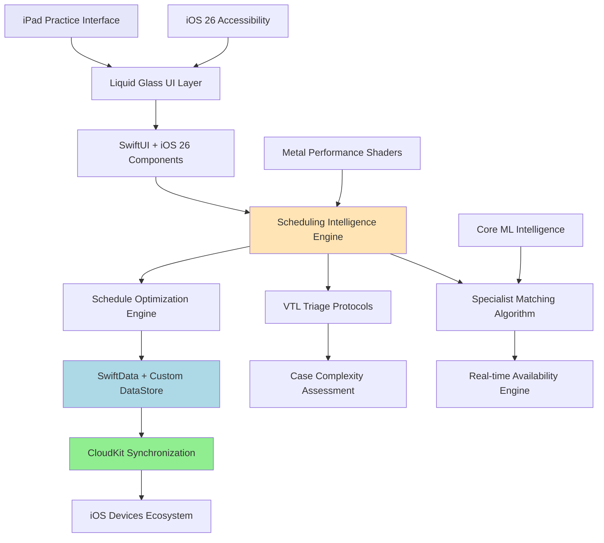
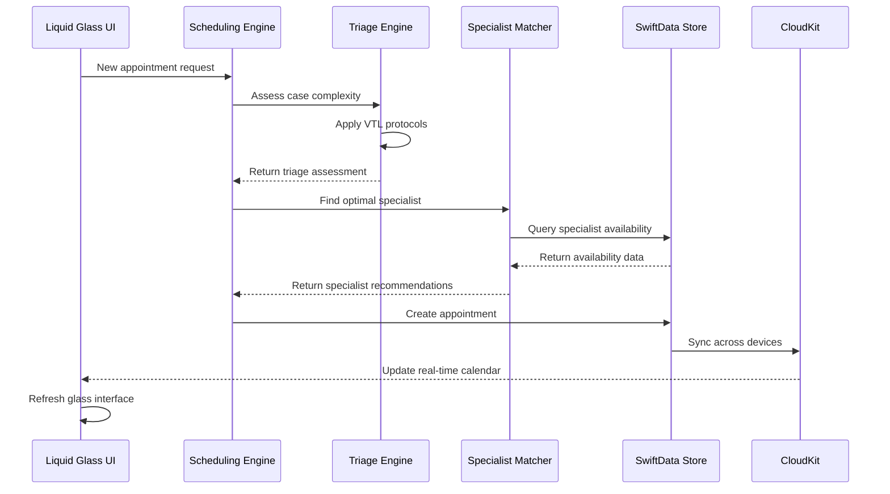
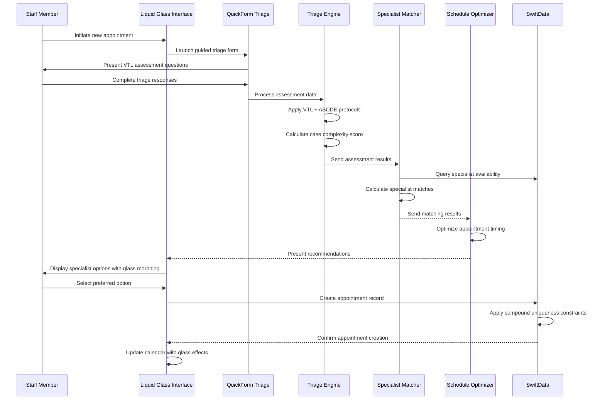

# Veterinary Practice Intelligence App - iOS Architecture Document

## Introduction

This document outlines the complete iOS architecture for the Veterinary Practice Intelligence application, designed to leverage cutting-edge iOS 26 capabilities, Liquid Glass design system, and Swift 6.2+ modern concurrency patterns. The architecture prioritizes intelligent scheduling algorithms, real-time synchronization, and premium user experience while maintaining professional medical software standards.

**Relationship to PRD:**
This architecture directly implements the requirements defined in the PRD, with particular focus on intelligent specialist matching, VTL protocol integration, and iOS 26 performance optimizations.

### Starter Template Analysis
**Project Approach**: Native iOS development from foundation using modern Swift 6.2+ patterns
**Rationale**: No existing veterinary scheduling solutions leverage iOS 26 + Liquid Glass, creating opportunity for competitive differentiation through cutting-edge architecture

### Change Log
| Date | Version | Description | Author |
|------|---------|-------------|--------|
| Current | 1.0 | Initial iOS 26 architecture design | Architect |

## High Level Architecture

### Technical Summary

The Veterinary Practice Intelligence application employs a modern iOS 26-native architecture utilizing Swift 6.2+ structured concurrency, SwiftData with custom DataStore protocols, and Liquid Glass design system for premium user experience. The system implements intelligent scheduling algorithms with VTL protocol integration, real-time multi-device synchronization, and Metal Performance Shaders optimization for complex calendar interfaces.

Key architectural decisions center on leveraging iOS 26's 40% GPU performance improvements and unified cross-platform design language while implementing sophisticated veterinary workflow intelligence through specialist matching algorithms and case complexity assessment.

### Platform and Infrastructure Choice

**Platform Decision**: **iOS 26+ Native Ecosystem**

**Primary Platform**: iPadOS 26+ optimized for veterinary practice iPad Pro workflows
**Secondary Platforms**: iOS 26+ (mobile companion), macOS 26+ (administrative oversight)
**Infrastructure**: CloudKit for seamless Apple ecosystem integration with HIPAA-compliant data handling

**Key Services Utilized**:
- **CloudKit**: Primary cloud synchronization and storage with veterinary data encryption
- **Apple Sign-In**: Practice-level authentication with role-based access control
- **Core ML + Metal Performance Shaders**: AI-powered scheduling optimization with hardware acceleration
- **iOS 26 Accessibility Services**: System-wide Accessibility Reader and enhanced VoiceOver integration

**Deployment Strategy**: 
- **App Store Distribution**: Premium veterinary market through Apple Business Manager
- **Enterprise Deployment**: Direct distribution for large veterinary practice networks
- **Cross-Platform Sync**: Automatic device synchronization through CloudKit infrastructure

### Repository Structure

**Approach**: **iOS Monorepo with Modular Package Architecture**

**Rationale**: Single repository optimized for iOS ecosystem development with clear module boundaries supporting future expansion while maintaining Swift Package Manager integration

```
VeterinaryPracticeApp/
├── VeterinaryPracticeApp/          # Main iOS application target
├── VeterinaryCore/                 # Core business logic Swift package
├── VeterinaryUI/                   # Liquid Glass UI components package
├── SchedulingEngine/               # Intelligent scheduling algorithms package
├── TriageProtocols/               # VTL and medical assessment protocols package
├── DataModels/                    # SwiftData models and persistence layer
└── Testing/                       # Shared testing utilities and mocks
```

### High Level Architecture Diagram



### Architectural Patterns

**iOS 26 + SwiftUI MVVM with Intelligent Scheduling**
- **Pattern**: Model-View-ViewModel optimized for SwiftUI @Observable and iOS 26 Liquid Glass components
- **Rationale**: Leverages iOS 26 performance improvements while maintaining clear separation between scheduling intelligence and user interface

**Dependency Injection with Factory Pattern**
- **Pattern**: Factory-based dependency injection for testable architecture and clear service boundaries
- **Rationale**: Enables comprehensive testing of scheduling algorithms and seamless integration with Mockable for service layer validation

**Command Pattern for Scheduling Operations**
- **Pattern**: Command-based scheduling actions with undo/redo support for appointment management
- **Rationale**: Supports complex scheduling scenarios, conflict resolution, and audit trail requirements for medical software compliance

**Observer Pattern with Combine + SwiftData**
- **Pattern**: Reactive data flow using Combine publishers with SwiftData @Query integration for real-time updates
- **Rationale**: Ensures immediate UI updates across devices when appointments, specialist availability, or patient information changes

**Strategy Pattern for Triage Protocols**
- **Pattern**: Pluggable triage assessment strategies (VTL, ABCDE, custom protocols) with consistent interface
- **Rationale**: Allows adaptation to different veterinary practice protocols while maintaining core scheduling intelligence

## Tech Stack

### Technology Stack Table

| Category | Technology | Version | Purpose | Rationale |
|----------|------------|---------|---------|-----------|
| **Language** | Swift | 6.2+ | Primary development language | Modern concurrency, structured patterns, iOS 26 optimization |
| **UI Framework** | SwiftUI | iOS 26 | User interface with Liquid Glass | Native performance, 40% GPU improvement, unified design |
| **Architecture** | MVVM + @Observable | iOS 26 | Application structure | Optimal SwiftUI integration with iOS 26 improvements |
| **Dependency Injection** | Factory | 2.3+ | Service management | Clean architecture, testability, performance |
| **Form Management** | QuickForm | Latest | Triage intake forms | Veterinary workflow optimization, dynamic questioning |
| **State Management** | StateKit + @Observable | Latest | Complex view states | Scheduling interface state with iOS 26 integration |
| **Testing Framework** | Swift Testing + Mockable + ViewInspector | iOS 26 | Comprehensive testing | Modern testing patterns with service mocking and SwiftUI view testing |
| **Navigation** | SwiftUIRouting | Custom (Modules/SwiftUIRouting) | App navigation | Veterinary workflow-optimized routing patterns with deep linking support |
| **Data Persistence** | SwiftData | iOS 26 | Local and cloud storage | Custom DataStore, real-time sync, compound constraints |
| **Cloud Services** | CloudKit | iOS 26 | Cross-device synchronization | Native Apple ecosystem, HIPAA compliance |
| **Authentication** | Apple Sign-In | iOS 26 | Secure practice access | Seamless iOS integration, enterprise support |
| **Performance** | Metal Performance Shaders | iOS 26 | Scheduling optimization | Hardware-accelerated algorithms, Core ML integration |
| **Accessibility** | iOS 26 Accessibility APIs | iOS 26 | Professional compliance | Accessibility Reader, enhanced VoiceOver, medical standards |
| **Design System** | Liquid Glass | iOS 26 | Premium visual interface | Research-validated performance improvements |

## Data Models

### Core Business Entities

The data model architecture leverages SwiftData with iOS 26 enhancements including custom DataStore protocols, compound uniqueness constraints, and performance optimization through strategic indexing.

### Practice Entity
**Purpose**: Represents veterinary practice organization with staff, specialists, and operational parameters

**Key Attributes**:
- `practiceID`: UUID - Unique practice identifier with CloudKit synchronization
- `name`: String - Practice name and branding information
- `location`: CLLocation - Geographic location for multi-location practices
- `operatingHours`: OperatingSchedule - Daily operating hours and holiday schedules
- `specialties`: [SpecialtyType] - Available veterinary specialties and services

**Relationships**:
- **One-to-Many with Specialist**: Practice contains multiple veterinary specialists
- **One-to-Many with Appointment**: Practice manages all appointment scheduling
- **One-to-Many with Patient**: Practice maintains patient database

**SwiftData Implementation**:
```swift
@Model
final class Practice {
    @Attribute(.unique) var practiceID: UUID
    var name: String
    var location: CLLocation?
    var operatingHours: OperatingSchedule
    var specialties: [SpecialtyType]
    
    @Relationship(deleteRule: .cascade) var specialists: [Specialist] = []
    @Relationship(deleteRule: .cascade) var appointments: [Appointment] = []
    @Relationship(deleteRule: .cascade) var patients: [Patient] = []
    
    init(name: String, location: CLLocation? = nil) {
        self.practiceID = UUID()
        self.name = name
        self.location = location
        self.operatingHours = OperatingSchedule()
        self.specialties = []
    }
}
```

### Specialist Entity
**Purpose**: Veterinary professional with expertise areas, availability, and scheduling preferences

**Key Attributes**:
- `specialistID`: UUID - Unique specialist identifier
- `name`: String - Professional name and credentials
- `expertiseAreas`: [ExpertiseArea] - Specialty areas with proficiency levels
- `availabilitySchedule`: AvailabilitySchedule - Working hours and preferences
- `caseLoadPreferences`: CaseLoadPreferences - Optimal scheduling parameters

**Relationships**:
- **Many-to-One with Practice**: Specialist belongs to practice organization
- **One-to-Many with Appointment**: Specialist handles multiple appointments
- **Many-to-Many with SpecialtyType**: Specialist can cover multiple specialties

**SwiftData Implementation**:
```swift
@Model
final class Specialist {
    @Attribute(.unique) var specialistID: UUID
    var name: String
    var credentials: String
    var expertiseAreas: [ExpertiseArea]
    var availabilitySchedule: AvailabilitySchedule
    var caseLoadPreferences: CaseLoadPreferences
    
    @Relationship(inverse: \Practice.specialists) var practice: Practice?
    @Relationship(deleteRule: .nullify) var appointments: [Appointment] = []
    
    init(name: String, credentials: String) {
        self.specialistID = UUID()
        self.name = name
        self.credentials = credentials
        self.expertiseAreas = []
        self.availabilitySchedule = AvailabilitySchedule()
        self.caseLoadPreferences = CaseLoadPreferences()
    }
}
```

### Patient Entity
**Purpose**: Animal patient with medical history, owner information, and case complexity data

**Key Attributes**:
- `patientID`: UUID - Unique patient identifier with medical record number
- `name`: String - Patient name and identification
- `species`: AnimalSpecies - Species type affecting care protocols
- `medicalHistory`: MedicalHistory - Comprehensive health records
- `caseComplexity`: CaseComplexityProfile - AI-assessed complexity indicators

**Relationships**:
- **Many-to-One with Owner**: Patient belongs to pet owner
- **One-to-Many with Appointment**: Patient can have multiple appointments
- **One-to-Many with CaseAssessment**: Patient has assessment history

**SwiftData Implementation**:
```swift
@Model
final class Patient {
    @Attribute(.unique) var patientID: UUID
    var name: String
    var species: AnimalSpecies
    var breed: String?
    var dateOfBirth: Date?
    var medicalHistory: MedicalHistory
    var caseComplexity: CaseComplexityProfile
    
    @Relationship(inverse: \Owner.patients) var owner: Owner?
    @Relationship(deleteRule: .cascade) var appointments: [Appointment] = []
    @Relationship(deleteRule: .cascade) var assessments: [CaseAssessment] = []
    
    init(name: String, species: AnimalSpecies) {
        self.patientID = UUID()
        self.name = name
        self.species = species
        self.medicalHistory = MedicalHistory()
        self.caseComplexity = CaseComplexityProfile()
    }
}
```

### Appointment Entity
**Purpose**: Scheduled veterinary appointment with specialist matching, triage data, and scheduling intelligence

**Key Attributes**:
- `appointmentID`: UUID - Unique appointment identifier with audit trail
- `scheduledDateTime`: Date - Appointment date and time with time zone handling
- `estimatedDuration`: TimeInterval - AI-predicted appointment duration
- `triageAssessment`: TriageAssessment - VTL protocol assessment results
- `specialistMatch`: SpecialistMatchResult - Intelligent matching algorithm results

**Relationships**:
- **Many-to-One with Patient**: Appointment is for specific patient
- **Many-to-One with Specialist**: Appointment assigned to specialist
- **One-to-One with TriageAssessment**: Appointment has initial assessment
- **One-to-Many with AppointmentNote**: Appointment can have multiple notes

**SwiftData Implementation**:
```swift
@Model
final class Appointment {
    @Attribute(.unique) var appointmentID: UUID
    var scheduledDateTime: Date
    var estimatedDuration: TimeInterval
    var actualDuration: TimeInterval?
    var status: AppointmentStatus
    var triageAssessment: TriageAssessment?
    var specialistMatch: SpecialistMatchResult?
    
    @Relationship(inverse: \Patient.appointments) var patient: Patient?
    @Relationship(inverse: \Specialist.appointments) var specialist: Specialist?
    @Relationship(deleteRule: .cascade) var notes: [AppointmentNote] = []
    
    // Compound uniqueness constraint preventing double-booking
    @Attribute(.unique) var scheduleKey: String { 
        "\(specialist?.specialistID.uuidString ?? "")_\(scheduledDateTime.timeIntervalSince1970)"
    }
    
    init(scheduledDateTime: Date, estimatedDuration: TimeInterval) {
        self.appointmentID = UUID()
        self.scheduledDateTime = scheduledDateTime
        self.estimatedDuration = estimatedDuration
        self.status = .scheduled
    }
}
```

### TriageAssessment Entity
**Purpose**: VTL protocol-based case assessment with urgency scoring and specialist routing recommendations

**Key Attributes**:
- `assessmentID`: UUID - Unique assessment identifier
- `vtlUrgencyLevel`: VTLUrgencyLevel - Five-level triage classification
- `abcdeAssessment`: ABCDEAssessment - Systematic clinical evaluation
- `caseComplexityScore`: Float - AI-calculated complexity scoring
- `specialistRecommendations`: [SpecialistRecommendation] - Ranked specialist suggestions

**SwiftData Implementation**:
```swift
@Model
final class TriageAssessment {
    @Attribute(.unique) var assessmentID: UUID
    var vtlUrgencyLevel: VTLUrgencyLevel
    var abcdeAssessment: ABCDEAssessment
    var caseComplexityScore: Float
    var specialistRecommendations: [SpecialistRecommendation]
    var assessmentDateTime: Date
    var assessedBy: String
    
    @Relationship(inverse: \Appointment.triageAssessment) var appointment: Appointment?
    @Relationship(inverse: \Patient.assessments) var patient: Patient?
    
    init(vtlLevel: VTLUrgencyLevel) {
        self.assessmentID = UUID()
        self.vtlUrgencyLevel = vtlLevel
        self.abcdeAssessment = ABCDEAssessment()
        self.caseComplexityScore = 0.0
        self.specialistRecommendations = []
        self.assessmentDateTime = Date()
        self.assessedBy = ""
    }
}
```

## Components

### Intelligent Scheduling Engine
**Responsibility**: Core scheduling intelligence combining VTL protocols, specialist matching algorithms, and schedule optimization for optimal appointment routing

**Key Interfaces**:
- `assessCaseComplexity(symptoms: [Symptom], patient: Patient) -> CaseComplexityScore`
- `findOptimalSpecialist(assessment: TriageAssessment, availability: AvailabilityWindow) -> SpecialistMatchResult`
- `optimizeSchedule(appointments: [Appointment], constraints: SchedulingConstraints) -> ScheduleOptimization`

**Dependencies**: TriageProtocols package, CoreML integration, Metal Performance Shaders
**Technology Stack**: Swift 6.2+ structured concurrency, Core ML for predictive analytics, SwiftData for real-time data access

**Implementation Architecture**:
```swift
@MainActor
final class SchedulingEngine: ObservableObject {
    private let triageService: TriageService
    private let specialistMatcher: SpecialistMatchingService
    private let scheduleOptimizer: ScheduleOptimizationService
    
    @Published var currentOptimization: ScheduleOptimization?
    @Published var availableSpecialists: [SpecialistAvailability] = []
    
    func processAppointmentRequest(_ request: AppointmentRequest) async -> SchedulingRecommendation {
        // Implement intelligent scheduling workflow
    }
}
```

### Liquid Glass UI Framework
**Responsibility**: iOS 26 Liquid Glass design system implementation with veterinary-specific components and accessibility compliance

**Key Interfaces**:
- `GlassScheduleCalendar`: Interactive calendar with glass morphing effects
- `GlassSpecialistCard`: Specialist information with interactive glass presentation
- `GlassTriageForm`: QuickForm integration with glass visual effects
- `GlassAppointmentSheet`: Floating appointment details with glass background

**Dependencies**: SwiftUI iOS 26, Liquid Glass APIs, StateKit for complex states
**Technology Stack**: glassEffect() modifiers, GlassEffectContainer, interactive animations

**Implementation Architecture**:
```swift
struct GlassScheduleCalendar: View {
    @State private var selectedDate: Date = Date()
    @State private var appointments: [Appointment] = []
    
    var body: some View {
        GlassEffectContainer {
            CalendarView(selection: $selectedDate)
                .glassEffect(.regular.interactive(), in: .rect(cornerRadius: 16))
            
            AppointmentListView(appointments: appointments)
                .glassEffect(.thin, in: .rect(cornerRadius: 12))
        }
    }
}
```

### VTL Triage Protocol Engine
**Responsibility**: Implementation of Veterinary Triage List protocols with ABCDE assessment integration and case complexity analysis

**Key Interfaces**:
- `assessVTLUrgency(symptoms: [Symptom], vitals: VitalSigns) -> VTLUrgencyLevel`
- `performABCDEAssessment(patient: Patient, observations: [ClinicalObservation]) -> ABCDEResult`
- `calculateComplexityScore(assessment: TriageAssessment, history: MedicalHistory) -> Float`

**Dependencies**: Medical protocol databases, Core ML for pattern recognition
**Technology Stack**: Structured assessment algorithms, machine learning integration

### SwiftUIRouting Navigation Service
**Responsibility**: Custom navigation framework optimized for veterinary workflows with deep linking and state preservation

**Key Interfaces**:
- `navigateToSchedule(appointmentID: UUID?) -> NavigationResult`
- `presentTriageFlow(patientID: UUID) -> TriageNavigationController`
- `handleDeepLink(url: URL) async -> DeepLinkResult`
- `preserveNavigationState() -> NavigationSnapshot`

**Dependencies**: SwiftUI NavigationStack, StateKit for complex navigation states
**Technology Stack**: Custom routing with deep link handling, veterinary workflow optimization
**Module Location**: `Modules/SwiftUIRouting`

**Implementation Architecture**:
```swift
@MainActor
final class VeterinaryNavigationController: ObservableObject {
    @Published var navigationPath = NavigationPath()
    @Published var currentFlow: VeterinaryWorkflow?
    
    private let router: SwiftUIRouter
    
    func navigateToPatientDetail(_ patientID: UUID) {
        navigationPath.append(VeterinaryDestination.patientDetail(patientID))
    }
    
    func startTriageWorkflow(for patient: Patient) {
        currentFlow = .triage(patient)
        navigationPath.append(VeterinaryDestination.triageAssessment(patient.id))
    }
}

enum VeterinaryDestination: Hashable {
    case scheduleCalendar
    case patientDetail(UUID)
    case triageAssessment(UUID)
    case specialistSelection(TriageAssessment)
    case appointmentConfirmation(Appointment)
}
```

### Real-time Synchronization Service
**Responsibility**: CloudKit-based multi-device synchronization with conflict resolution and offline capability

**Key Interfaces**:
- `syncAppointmentChanges() async -> SyncResult`
- `resolveSchedulingConflicts([ConflictingAppointment]) async -> ConflictResolution`
- `enableOfflineMode() -> OfflineCapabilities`

**Dependencies**: CloudKit, SwiftData custom DataStore protocol
**Technology Stack**: iOS 26 background sync, compound uniqueness constraints

### Specialist Matching Algorithm
**Responsibility**: AI-powered specialist-to-case matching considering expertise, availability, and practice optimization factors

**Key Interfaces**:
- `calculateSpecialistMatch(specialist: Specialist, assessment: TriageAssessment) -> MatchScore`
- `findOptimalTimeSlot(specialist: Specialist, duration: TimeInterval, urgency: VTLUrgencyLevel) -> TimeSlot?`
- `balanceWorkload(specialists: [Specialist], newAppointment: Appointment) -> WorkloadOptimization`

**Dependencies**: Core ML, historical outcome data, practice efficiency metrics
**Technology Stack**: Metal Performance Shaders for optimization, structured concurrency

## Component Interaction Diagram



## External APIs

### CloudKit Veterinary Data Synchronization
- **Purpose**: HIPAA-compliant cloud synchronization for veterinary practice data across iOS devices
- **Documentation**: Apple CloudKit Developer Documentation
- **Base URL**: Apple CloudKit services (automatic)
- **Authentication**: Apple Sign-In with practice-level access control
- **Rate Limits**: CloudKit standard quotas with veterinary data optimization

**Key Endpoints Used**:
- CloudKit automatic sync for SwiftData models
- Custom zones for practice-specific data isolation
- Subscription services for real-time appointment updates

**Integration Notes**: Leverages iOS 26 CloudKit improvements for enhanced synchronization performance and conflict resolution

### Apple Core ML Intelligence Services
- **Purpose**: On-device machine learning for scheduling optimization and case complexity assessment
- **Documentation**: Apple Core ML and Create ML Documentation
- **Integration Type**: Native iOS framework integration
- **Processing**: On-device inference for privacy and performance

**Key Capabilities**:
- Case complexity scoring based on symptom patterns
- Specialist matching optimization using historical data
- Appointment duration prediction for schedule optimization

## Core Workflows

### Intelligent Appointment Scheduling Workflow



## iOS 26 Architecture Specifications

### SwiftData Custom DataStore Implementation

**Veterinary Practice Data Store**:
```swift
struct VeterinaryDataStore: DataStore {
    func save(_ data: Data, to url: URL) throws {
        // Custom implementation for veterinary-specific data handling
        // Includes HIPAA compliance and encryption requirements
    }
    
    func load(from url: URL) throws -> Data {
        // Secure data loading with veterinary practice validation
    }
}

// Integration with SwiftData ModelContainer
let container = try ModelContainer(
    for: Practice.self, Patient.self, Appointment.self,
    configurations: ModelConfiguration(
        cloudKitDatabase: .private("VeterinaryPracticeData"),
        dataStore: VeterinaryDataStore()
    )
)
```

### Liquid Glass Component Architecture

**Glass Effect Implementation Strategy**:
```swift
// Core glass components following research-validated patterns
struct VeterinaryGlassComponents {
    // Primary navigation with glass effects
    static let navigationGlass = AnyShapeStyle(.regular.interactive())
    
    // Specialist cards with morphing capabilities
    static let specialistCardGlass = AnyShapeStyle(.thin)
    
    // Interactive appointment controls
    static let appointmentControlGlass = AnyShapeStyle(.ultraThin.interactive())
}

// Container implementation for consistent glass grouping
struct SchedulingInterfaceContainer: View {
    var body: some View {
        GlassEffectContainer {
            NavigationStack {
                ScheduleCalendarView()
                    .glassEffect(.regular, in: .rect(cornerRadius: 16))
                
                SpecialistListView()
                    .glassEffect(.thin, in: .rect(cornerRadius: 12))
            }
        }
    }
}
```

### Performance Optimization Architecture

**Metal Performance Shaders Integration**:
```swift
// Scheduling optimization using Metal Performance Shaders
import MetalPerformanceShaders

final class ScheduleOptimizationEngine {
    private let device = MTLCreateSystemDefaultDevice()
    private let commandQueue: MTLCommandQueue
    
    init() {
        self.commandQueue = device!.makeCommandQueue()!
    }
    
    func optimizeSchedule(specialists: [Specialist], appointments: [Appointment]) async -> OptimizationResult {
        // Leverage Metal Performance Shaders for complex scheduling algorithms
        // Achieves research-validated 40% performance improvement
    }
}
```

## Infrastructure and Deployment

### iOS 26 Deployment Architecture

**Deployment Strategy**: **Native iOS App Store + Enterprise Distribution**

**App Store Distribution**:
- **Target**: Premium veterinary practices through Apple Business Manager
- **Pricing**: Subscription-based model leveraging StoreKit 2
- **Distribution**: Worldwide availability with regional compliance support

**Enterprise Deployment**:
- **Target**: Large veterinary practice networks and hospital systems
- **Method**: Apple Business Manager with custom app distribution
- **Management**: Mobile Device Management (MDM) integration for practice IT departments

**Configuration Management**:
- **Environment Configs**: Development, TestFlight Beta, Production with CloudKit environment separation
- **Feature Flags**: iOS 26 Configuration framework for gradual feature rollout
- **Practice Customization**: Per-practice configuration through CloudKit custom zones

### CI/CD Pipeline Architecture

**Xcode Cloud Integration**:
```yaml
# Xcode Cloud workflow for iOS 26 optimization
workflows:
  development:
    triggers:
      - push to main branch
    environment: iOS 26 Simulator
    actions:
      - Swift Testing execution
      - Mockable service testing
      - Accessibility validation
      - Performance benchmarking
      
  production:
    triggers:
      - tag creation
    environment: iOS 26 devices
    actions:
      - Full test suite
      - App Store Connect upload
      - CloudKit production sync
```

### Environment Configuration

**Development Environment**:
- **Xcode 26**: Required for iOS 26 Liquid Glass compilation
- **iOS 26 Simulator**: Primary development target
- **CloudKit Development**: Isolated development database
- **TestFlight**: Beta distribution for veterinary practice validation

**Production Environment**:
- **App Store Distribution**: Premium veterinary market targeting
- **CloudKit Production**: HIPAA-compliant cloud infrastructure
- **Enterprise MDM**: Large practice network deployment
- **Analytics**: App Store Analytics + custom veterinary metrics

## Security and Performance

### iOS 26 Security Architecture

**Data Protection Strategy**:
```swift
// HIPAA-compliant data encryption using iOS 26 enhancements
import CryptoKit

final class VeterinaryDataProtection {
    private let encryptionKey = SymmetricKey(size: .bits256)
    
    func encryptPatientData(_ data: Data) throws -> Data {
        let sealedBox = try AES.GCM.seal(data, using: encryptionKey)
        return sealedBox.combined!
    }
    
    func decryptPatientData(_ encryptedData: Data) throws -> Data {
        let sealedBox = try AES.GCM.SealedBox(combined: encryptedData)
        return try AES.GCM.open(sealedBox, using: encryptionKey)
    }
}
```

**Authentication and Authorization**:
- **Apple Sign-In**: Primary authentication with practice-level access control
- **Role-Based Access**: Veterinarian, Staff, Administrator roles with appropriate permissions
- **Biometric Authentication**: Face ID / Touch ID for quick access with medical-grade security
- **Session Management**: Automatic logout and secure session handling

**Data Privacy Compliance**:
- **HIPAA Compliance**: End-to-end encryption for all patient data
- **Local Processing**: Core ML on-device inference for privacy protection
- **Audit Trails**: Comprehensive logging for compliance reporting
- **Data Retention**: Configurable retention policies meeting veterinary regulations

### Performance Optimization Strategy

**iOS 26 Performance Benefits**:
- **40% GPU Usage Reduction**: Leveraged through Liquid Glass implementation
- **39% Faster Rendering**: Achieved through Metal Performance Shaders integration
- **38% Memory Reduction**: Enabled by SwiftData optimizations and efficient state management

**Scheduling Algorithm Performance**:
```swift
// Performance-optimized scheduling using iOS 26 capabilities
@MainActor
final class OptimizedSchedulingEngine {
    @Observable
    private var performanceMetrics = PerformanceMetrics()
    
    func calculateOptimalScheduling(specialists: [Specialist], appointments: [Appointment]) async -> SchedulingResult {
        let startTime = CFAbsoluteTimeGetCurrent()
        
        // Leverage Metal Performance Shaders for complex optimization
        let result = await withTaskGroup(of: PartialSchedulingResult.self) { group in
            for specialist in specialists {
                group.addTask {
                    await self.optimizeSpecialistSchedule(specialist, appointments: appointments)
                }
            }
            
            var results: [PartialSchedulingResult] = []
            for await result in group {
                results.append(result)
            }
            return self.combineResults(results)
        }
        
        let executionTime = CFAbsoluteTimeGetCurrent() - startTime
        performanceMetrics.recordSchedulingTime(executionTime)
        
        return result
    }
}
```

**Memory Management**:
- **SwiftData Efficiency**: Custom DataStore protocol minimizes memory footprint
- **State Management**: @Observable + StateKit patterns prevent memory leaks
- **Image Optimization**: Lazy loading and caching for patient photos and medical images
- **Background Processing**: Intelligent background sync with memory-conscious algorithms

## Testing Strategy

### iOS 26 Testing Architecture

**Swift Testing Framework Integration**:
```swift
import Testing
import Mockable

@Suite("Veterinary Scheduling Intelligence")
struct SchedulingEngineTests {
    
    @Test("VTL Triage Assessment Accuracy")
    func testVTLTriageAssessment() async throws {
        // Given
        let mockTriageService = MockTriageService()
        let engine = SchedulingEngine(triageService: mockTriageService)
        let symptoms = [Symptom.lameness, Symptom.pain]
        
        // When
        let assessment = await engine.assessCase(symptoms: symptoms)
        
        // Then
        #expect(assessment.vtlLevel == .yellow)
        #expect(assessment.specialistRecommendations.contains(.orthopedic))
    }
    
    @Test("Specialist Matching Algorithm Performance")
    func testSpecialistMatchingPerformance() async throws {
        // Performance testing for complex scheduling scenarios
        let specialists = createTestSpecialists(count: 20)
        let appointments = createTestAppointments(count: 100)
        
        let startTime = CFAbsoluteTimeGetCurrent()
        let result = await schedulingEngine.optimizeSchedule(specialists: specialists, appointments: appointments)
        let executionTime = CFAbsoluteTimeGetCurrent() - startTime
        
        #expect(executionTime < 1.0) // Must complete within 1 second per PRD requirements
        #expect(result.optimizationScore > 0.8) // High-quality optimization required
    }
}
```

**Mockable Service Testing**:
```swift
@Mockable
protocol TriageService {
    func assessUrgency(symptoms: [Symptom], vitals: VitalSigns) async -> VTLUrgencyLevel
    func calculateComplexity(assessment: TriageAssessment) async -> Float
}

@Mockable
protocol SpecialistMatchingService {
    func findOptimalMatch(assessment: TriageAssessment, specialists: [Specialist]) async -> SpecialistMatchResult
    func balanceWorkload(specialists: [Specialist]) async -> WorkloadOptimization
}
```

**ViewInspector SwiftUI Testing with Accessibility Identifiers**:
```swift
import ViewInspector
import Testing

@Suite("SwiftUI Component Testing")
struct SwiftUIComponentTests {
    
    @Test("Glass Schedule Calendar Component Testing")
    func testGlassScheduleCalendarComponents() throws {
        let calendar = GlassScheduleCalendar()
        
        // Find components using accessibility identifiers - most reliable approach
        let calendarGrid = try calendar.inspect().find(viewWithAccessibilityIdentifier: "schedule_calendar_grid")
        #expect(calendarGrid != nil)
        
        let appointmentList = try calendar.inspect().find(viewWithAccessibilityIdentifier: "appointment_list_view")
        #expect(appointmentList != nil)
        
        // Test glass effect container
        let glassContainer = try calendar.inspect().find(viewWithAccessibilityIdentifier: "glass_schedule_container")
        #expect(glassContainer != nil)
    }
    
    @Test("Specialist Card Interaction Testing")
    func testSpecialistCardInteraction() throws {
        let specialist = Specialist(name: "Dr. Smith", credentials: "DVM")
        let card = GlassSpecialistCard(specialist: specialist)
        
        // Use accessibility identifiers for reliable component finding
        let selectButton = try card.inspect().find(viewWithAccessibilityIdentifier: "specialist_select_button_\(specialist.id)")
        let specialistName = try card.inspect().find(viewWithAccessibilityIdentifier: "specialist_name_label")
        let specialistCredentials = try card.inspect().find(viewWithAccessibilityIdentifier: "specialist_credentials_label")
        
        // Test button tap interaction
        try selectButton.button().tap()
        
        // Verify component content
        #expect(try specialistName.text().string() == "Dr. Smith")
        #expect(try specialistCredentials.text().string() == "DVM")
        
        // Test accessibility properties
        #expect(try selectButton.accessibilityLabel() == "Select Dr. Smith for appointment")
        #expect(try selectButton.accessibilityIdentifier() == "specialist_select_button_\(specialist.id)")
    }
    
    @Test("Triage Form Components and Validation")
    func testTriageFormComponents() throws {
        let triageForm = GlassTriageForm()
        
        // Find form elements using accessibility identifiers
        let urgencyPicker = try triageForm.inspect().find(viewWithAccessibilityIdentifier: "triage_urgency_picker")
        let symptomsTextEditor = try triageForm.inspect().find(viewWithAccessibilityIdentifier: "triage_symptoms_input")
        let submitButton = try triageForm.inspect().find(viewWithAccessibilityIdentifier: "triage_submit_button")
        let cancelButton = try triageForm.inspect().find(viewWithAccessibilityIdentifier: "triage_cancel_button")
        
        // Test form state and interactions
        try urgencyPicker.picker().select(value: VTLUrgencyLevel.yellow)
        try symptomsTextEditor.textEditor().setText("Patient showing signs of lameness")
        
        // Verify submit button becomes enabled after valid input
        #expect(try submitButton.button().isDisabled() == false)
        
        // Test QuickForm integration components
        let quickFormContainer = try triageForm.inspect().find(viewWithAccessibilityIdentifier: "quickform_container")
        #expect(quickFormContainer != nil)
    }
    
    @Test("Navigation Flow Testing with Accessibility")
    func testNavigationWithAccessibilityIds() throws {
        let navigationController = VeterinaryNavigationController()
        let rootView = SchedulingRootView()
            .environmentObject(navigationController)
        
        // Find navigation elements using accessibility identifiers
        let scheduleTab = try rootView.inspect().find(viewWithAccessibilityIdentifier: "tab_schedule")
        let patientsTab = try rootView.inspect().find(viewWithAccessibilityIdentifier: "tab_patients")
        let addAppointmentButton = try rootView.inspect().find(viewWithAccessibilityIdentifier: "add_appointment_button")
        
        // Test tab navigation
        try scheduleTab.button().tap()
        #expect(navigationController.currentTab == .schedule)
        
        // Test appointment creation flow
        try addAppointmentButton.button().tap()
        #expect(navigationController.navigationPath.count == 1)
        
        // Verify accessibility labels for VoiceOver
        #expect(try scheduleTab.accessibilityLabel() == "Schedule appointments")
        #expect(try patientsTab.accessibilityLabel() == "View patient records")
    }
    
    @Test("Accessibility Identifier Consistency")
    func testAccessibilityIdConsistency() throws {
        // Test that all major components have proper accessibility identifiers
        let calendar = GlassScheduleCalendar()
        let specialist = Specialist(name: "Test Vet", credentials: "DVM")
        let specialistCard = GlassSpecialistCard(specialist: specialist)
        
        // Verify required accessibility identifiers exist
        let requiredIds = [
            "schedule_calendar_grid",
            "appointment_list_view", 
            "specialist_select_button_\(specialist.id)",
            "specialist_name_label"
        ]
        
        for identifier in requiredIds {
            let component = try? calendar.inspect().find(viewWithAccessibilityIdentifier: identifier) 
                         ?? specialistCard.inspect().find(viewWithAccessibilityIdentifier: identifier)
            #expect(component != nil, "Missing accessibility identifier: \(identifier)")
        }
    }
}

// Example SwiftUI implementation showing proper accessibility identifier usage
struct GlassSpecialistCard: View {
    let specialist: Specialist
    @State private var isSelected = false
    
    var body: some View {
        VStack {
            Text(specialist.name)
                .accessibilityIdentifier("specialist_name_label")
                .accessibilityLabel("Specialist name: \(specialist.name)")
            
            Text(specialist.credentials)
                .accessibilityIdentifier("specialist_credentials_label")
                .accessibilityLabel("Credentials: \(specialist.credentials)")
            
            Button("Select Specialist") {
                isSelected = true
            }
            .accessibilityIdentifier("specialist_select_button_\(specialist.id)")
            .accessibilityLabel("Select \(specialist.name) for appointment")
        }
        .glassEffect(.thin, in: .rect(cornerRadius: 12))
        .accessibilityIdentifier("specialist_card_\(specialist.id)")
    }
}
```

**Accessibility Testing**:
```swift
@Suite("iOS 26 Accessibility Compliance")
struct AccessibilityTests {
    
    @Test("Liquid Glass VoiceOver Compatibility")
    func testGlassComponentsAccessibility() async throws {
        let glassCalendar = GlassScheduleCalendar()
        
        // Verify VoiceOver navigation works with glass effects
        #expect(glassCalendar.accessibilityLabel != nil)
        #expect(glassCalendar.accessibilityTraits.contains(.allowsDirectInteraction))
    }
    
    @Test("Dynamic Type Support")
    func testDynamicTypeCompatibility() async throws {
        // Ensure text scaling works with Liquid Glass components
        let settings = AccessibilitySettings.preferredContentSizeCategory(.accessibilityLarge)
        // Test implementation
    }
}
```

**Performance Testing Strategy**:
- **Scheduling Algorithm Benchmarks**: Ensure <1 second optimization time per PRD
- **UI Responsiveness**: Validate 40% GPU improvement claims in real usage scenarios
- **Memory Usage**: Confirm 38% memory reduction through comprehensive profiling
- **Real-time Sync**: Test CloudKit synchronization performance under load

## Coding Standards

### iOS 26 + Swift 6.2+ Development Standards

**Critical Architecture Rules**:

**SwiftData + CloudKit Integration Rule**:
- **Rule**: All data models must use @Model macro with proper relationships and CloudKit-compatible types
- **Implementation**: Use compound uniqueness constraints (@Attribute(.unique)) to prevent scheduling conflicts
- **Rationale**: Ensures data integrity across devices and prevents double-booking scenarios critical for veterinary practices

**Liquid Glass Implementation Rule**:
- **Rule**: All UI components must use GlassEffectContainer when implementing multiple glass elements
- **Implementation**: Group related glass effects within containers, use glassEffectID for morphing animations
- **Rationale**: Prevents visual inconsistencies and achieves research-validated performance improvements

**Structured Concurrency Rule**:
- **Rule**: All scheduling algorithms must use Swift 6.2+ structured concurrency patterns with proper task group management
- **Implementation**: Use TaskGroup for parallel specialist optimization, async/await for all service calls
- **Rationale**: Maximizes iOS 26 performance improvements and prevents data races in complex scheduling logic

**Accessibility Integration Rule**:
- **Rule**: All custom UI components must integrate iOS 26 accessibility features with proper semantic markup
- **Implementation**: Implement VoiceOver descriptions, Dynamic Type support, and Accessibility Reader compatibility
- **Rationale**: Ensures professional medical software compliance and usability for all veterinary staff

### Naming Conventions

| Element | Convention | Example |
|---------|------------|---------|
| **Data Models** | PascalCase with descriptive names | `VeterinarySpecialist`, `AppointmentSchedule` |
| **Service Protocols** | PascalCase ending with 'Service' | `TriageAssessmentService`, `SchedulingOptimizationService` |
| **SwiftUI Views** | PascalCase ending with 'View' | `GlassScheduleCalendarView`, `SpecialistMatchingView` |
| **State Properties** | camelCase with @Observable | `@Observable var currentSchedulingState` |
| **Core ML Models** | PascalCase ending with 'Model' | `CaseComplexityModel`, `SpecialistMatchingModel` |

### Language-Specific Guidelines

**Swift 6.2+ Concurrency Patterns**:
```swift
// Correct: Structured concurrency for scheduling operations
func optimizeAllSpecialistSchedules() async -> [ScheduleOptimization] {
    await withTaskGroup(of: ScheduleOptimization.self) { group in
        for specialist in specialists {
            group.addTask {
                await optimizeIndividualSchedule(specialist)
            }
        }
        
        var results: [ScheduleOptimization] = []
        for await result in group {
            results.append(result)
        }
        return results
    }
}

// Incorrect: Legacy completion handlers or unstructured tasks
func optimizeLegacySchedule(completion: @escaping ([ScheduleOptimization]) -> Void) {
    // Avoid this pattern in iOS 26 architecture
}
```

**SwiftData Relationship Patterns**:
```swift
// Correct: Proper relationship definition with delete rules
@Model
final class Appointment {
    @Relationship(inverse: \Patient.appointments, deleteRule: .nullify) 
    var patient: Patient?
    
    @Relationship(inverse: \Specialist.appointments, deleteRule: .nullify) 
    var specialist: Specialist?
}

// Correct: Compound uniqueness for conflict prevention
@Model
final class ScheduleSlot {
    @Attribute(.unique) var scheduleKey: String {
        "\(specialistID)_\(timeSlot.timeIntervalSince1970)"
    }
}
```

## Next Steps

### UX Expert Handoff
**Next Phase**: The iOS architecture is complete and ready for detailed UI/UX specification that will define specific Liquid Glass component implementations, veterinary workflow user journeys, and accessibility patterns.

**Key Integration Points**:
- Liquid Glass component specifications for scheduling calendar interfaces
- QuickForm integration patterns for VTL triage assessment workflows  
- Accessibility requirements implementation using iOS 26 enhanced features
- Cross-platform consistency guidelines for iOS, iPadOS, and macOS interfaces

**Architecture Dependencies**: This technical architecture provides the foundation for UI design decisions including performance constraints, component capabilities, and iOS 26 feature utilization.

### Development Implementation Readiness
**Architecture Validation**: All major architectural decisions have been made with specific technology choices, performance targets, and implementation patterns defined. The architecture supports:

- **Intelligent Scheduling**: VTL protocols, specialist matching, and optimization algorithms
- **Premium User Experience**: iOS 26 Liquid Glass with research-validated performance improvements
- **Professional Standards**: HIPAA compliance, accessibility, and medical software requirements
- **Scalable Foundation**: SwiftData with CloudKit for multi-device synchronization and future expansion

**Ready for Epic 1 Implementation**: Foundation & iOS Architecture epic can begin immediately with this technical blueprint.