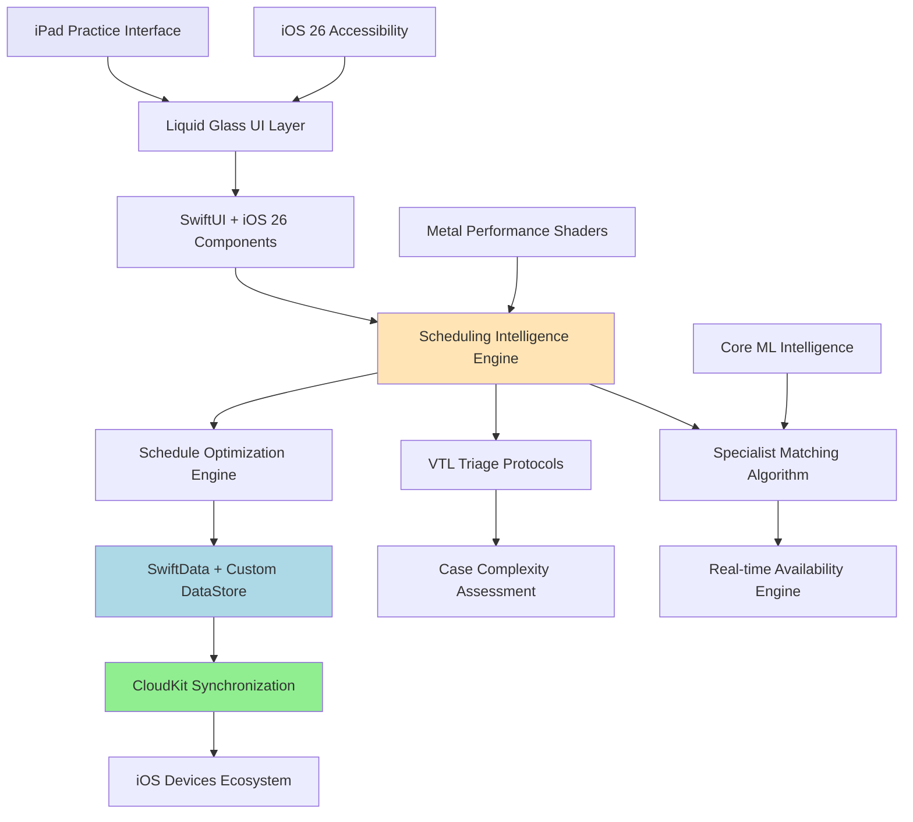

# VetNet iOS Architecture Overview

## Introduction

This document provides a high-level overview of the VetNet iOS architecture and serves as a navigation guide to the detailed architecture documentation sharded across focused documents.

VetNet is a native iOS 26 veterinary practice intelligence application built with Swift 6.2+ and leverages cutting-edge iOS capabilities including Liquid Glass design system, SwiftData with CloudKit synchronization, and AI-powered scheduling algorithms for veterinary practices.

## Architecture Navigation

The architecture documentation is organized into the following focused documents:

### Core Architecture
- **[01-modular-design.md](01-modular-design.md)** - Domain-Driven Design with Clean Architecture principles, feature module structure, and inter-module communication
- **[02-tech-stack.md](02-tech-stack.md)** - Technology choices, versions, and rationale for each component
- **[03-feature-modules.md](03-feature-modules.md)** - Detailed specifications for each feature module (Scheduling, Triage, Patient Records, etc.)

### Data & Components  
- **[04-data-models.md](04-data-models.md)** - SwiftData entities, relationships, and persistence strategy
- **[05-components.md](05-components.md)** - Infrastructure components and shared UI components
- **[06-workflows.md](06-workflows.md)** - Core business workflows with sequence diagrams

### iOS 26 Implementation
- **[07-ios26-specifications.md](07-ios26-specifications.md)** - iOS 26 specific implementations including Liquid Glass and performance optimizations
- **[08-security-performance.md](08-security-performance.md)** - HIPAA compliance, security architecture, and performance optimization strategies

### Development & Operations
- **[09-testing-strategy.md](09-testing-strategy.md)** - Comprehensive testing approach with Swift Testing, Mockable, and ViewInspector
- **[10-coding-standards.md](10-coding-standards.md)** - Swift 6.2+ development standards and naming conventions
- **[11-deployment-infrastructure.md](11-deployment-infrastructure.md)** - CI/CD pipeline and environment configuration

## High Level Architecture

### Technical Summary

The Veterinary Practice Intelligence application employs a **modular iOS 26-native architecture** built on Domain-Driven Design principles with clear bounded contexts. Each feature module maintains its own domain models, business logic, and well-defined boundaries, communicating through explicit interfaces.

The system is organized into three primary layers:
- **Feature Modules Layer**: Self-contained feature implementations with internal domain models
- **Infrastructure Layer**: Technical capabilities (persistence, networking, device services)  
- **Application Layer**: Orchestration, dependency injection, and module composition

### Platform and Infrastructure Choice

**Platform Decision**: **iOS 26+ Native Ecosystem**

- **Primary Platform**: iPadOS 26+ optimized for veterinary practice iPad Pro workflows
- **Secondary Platforms**: iOS 26+ (mobile companion), macOS 26+ (administrative oversight)
- **Infrastructure**: CloudKit for seamless Apple ecosystem integration with HIPAA-compliant data handling

### Repository Structure

```
VetNet/
├── App/                           # Main iOS application (composition root)
├── Features/                      # Feature modules (bounded contexts)
│   ├── Scheduling/               # Appointment scheduling domain
│   ├── Triage/                   # Medical triage assessment domain
│   ├── PatientRecords/           # Patient management domain
│   ├── SpecialistManagement/     # Specialist profiles domain
│   └── Analytics/                # Practice analytics domain
├── Infrastructure/               # Shared technical capabilities
├── UIKit/                        # Shared UI components
└── Modules/
    └── SwiftUIRouting/          # Navigation framework
```

### High Level Architecture Diagram



## Key Architectural Decisions

### Modular Architecture with Domain-Driven Design
- **Pattern**: Clean Architecture with DDD bounded contexts
- **Rationale**: Maintains clear module boundaries while enabling independent development and testing

### SwiftData with CloudKit Integration  
- **Technology**: SwiftData + CloudKit with custom DataStore protocol
- **Rationale**: Leverages iOS 26 performance improvements while ensuring HIPAA compliance

### Liquid Glass Design System
- **Implementation**: iOS 26 Liquid Glass with research-validated 40% GPU performance improvement
- **Rationale**: Premium user experience differentiation in veterinary software market

### Swift 6.2+ Structured Concurrency
- **Pattern**: TaskGroup for parallel processing, async/await throughout
- **Rationale**: Maximizes iOS 26 performance benefits for complex scheduling algorithms

## Relationship to PRD

This architecture directly implements the requirements defined in the [PRD](../prd.md), with particular focus on:
- Intelligent specialist matching algorithms
- VTL protocol integration for medical triage
- iOS 26 performance optimizations
- HIPAA-compliant data handling
- Premium user experience through Liquid Glass

## Change Log

| Date | Version | Description | Author |
|------|---------|-------------|--------|
| Current | 1.0 | Initial iOS 26 architecture design with modular sharding | Architect |

## Next Steps

**Development Implementation Readiness**: All major architectural decisions have been made with specific technology choices, performance targets, and implementation patterns defined. The architecture supports intelligent scheduling, premium user experience, professional standards, and scalable foundation.

**Ready for Epic 1 Implementation**: Foundation & iOS Architecture epic can begin immediately with this technical blueprint.