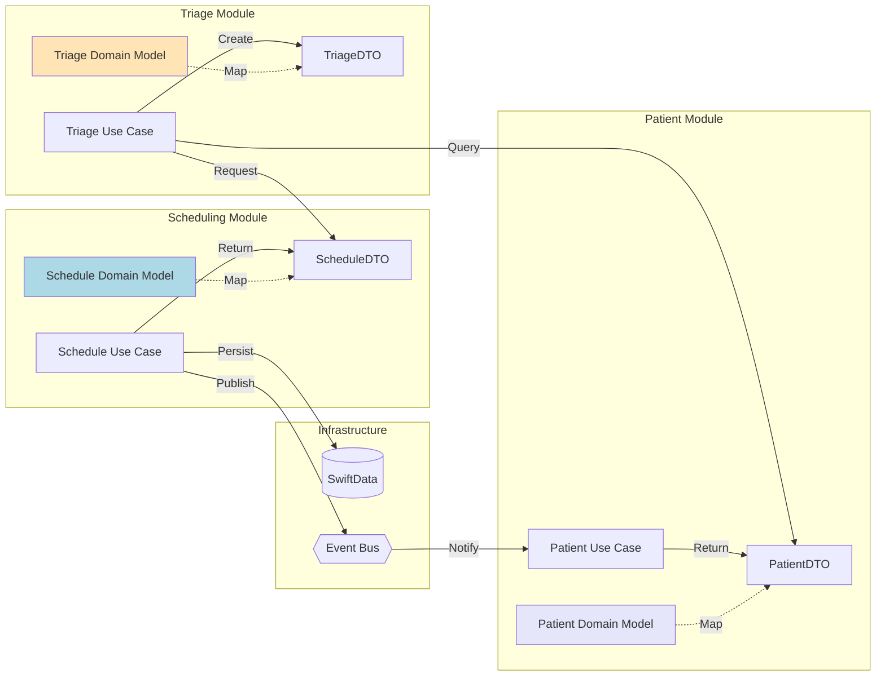

# Modular Architecture Design

## Overview

The VetNet application follows a **Domain-Driven Design (DDD)** approach with **Clean Architecture** principles, ensuring each feature module is self-contained with clear boundaries and explicit dependencies. This document details the modular architecture design, inter-module communication patterns, and architectural benefits.

Related documents: [00-overview.md](00-overview.md) | [03-feature-modules.md](03-feature-modules.md)

## Architecture Overview

The application employs a modular iOS 26-native architecture with clear separation of concerns across three primary layers:

### Core Principles

- **Bounded Contexts**: Each feature module represents a distinct bounded context with its own ubiquitous language
- **Dependency Rule**: Dependencies point inward - Presentation depends on Application, Application depends on Domain
- **Interface Segregation**: Modules communicate only through well-defined public interfaces
- **Single Responsibility**: Each module handles one cohesive set of business capabilities

### Three-Layer Architecture

```mermaid
graph TB
    subgraph "Feature Modules Layer"
        Scheduling[Scheduling Module]
        Triage[Triage Module] 
        Patient[Patient Records Module]
        Specialist[Specialist Management Module]
        Analytics[Analytics Module]
    end
    
    subgraph "Infrastructure Layer"
        Persistence[SwiftData + CloudKit]
        Networking[API Clients]
        Auth[Authentication]
        Device[Device Services]
        Monitor[Monitoring]
    end
    
    subgraph "Application Layer"
        DI[Dependency Injection]
        Orchestration[Module Orchestration]
        Navigation[App Coordinator]
        Lifecycle[App Lifecycle]
    end
    
    Scheduling --> Infrastructure
    Triage --> Infrastructure
    Patient --> Infrastructure
    Specialist --> Infrastructure
    Analytics --> Infrastructure
    
    Application --> Scheduling
    Application --> Triage
    Application --> Patient
    Application --> Specialist
    Application --> Analytics
    
    style "Feature Modules Layer" fill:#FFE4B5
    style "Infrastructure Layer" fill:#ADD8E6
    style "Application Layer" fill:#E6E6FA
```

## Feature Module Structure

Each feature module follows a consistent internal architecture based on Clean Architecture principles:

### Standard Module Layout

```
Features/Scheduling/                 # Example module
├── Package.swift                    # Module definition
├── Sources/
│   ├── Domain/                     # Core business logic (no external dependencies)
│   │   ├── Models/
│   │   │   ├── Appointment.swift   # Internal domain model
│   │   │   ├── TimeSlot.swift
│   │   │   └── ScheduleRules.swift
│   │   ├── Services/
│   │   │   └── SchedulingPolicy.swift
│   │   └── Repositories/
│   │       └── AppointmentRepository.swift  # Protocol only
│   ├── Application/                # Use cases & application services
│   │   ├── UseCases/
│   │   │   ├── ScheduleAppointmentUseCase.swift
│   │   │   └── RescheduleAppointmentUseCase.swift
│   │   └── Services/
│   │       └── ConflictResolutionService.swift
│   ├── Navigation/                 # SwiftUIRouting navigation layer
│   │   ├── SchedulingFormMode.swift      # Form modes for routing
│   │   ├── SchedulingFormResult.swift    # Form results with type safety
│   │   ├── SchedulingRoute.swift         # Navigation routes
│   │   └── SchedulingFormRouter.swift    # Router implementation
│   ├── Presentation/              # UI Layer
│   │   ├── ViewModels/
│   │   │   └── SchedulingViewModel.swift
│   │   └── Views/
│   │       └── ScheduleCalendarView.swift
│   └── Public/                    # Public API
│       ├── SchedulingModuleInterface.swift
│       ├── DTOs/
│       │   └── AppointmentDTO.swift
│       └── Events/
│           └── AppointmentScheduledEvent.swift

# Infrastructure is NOT part of individual feature modules
# It is shared at the Application level:
Infrastructure/                      # Shared across ALL features
├── Persistence/
│   ├── Entities/                   # SwiftData @Model entities
│   │   ├── AppointmentEntity.swift
│   │   ├── PatientEntity.swift
│   │   └── SpecialistEntity.swift
│   └── Repositories/               # Repository implementations
│       ├── SwiftDataAppointmentRepository.swift
│       └── SwiftDataPatientRepository.swift
├── Services/
│   ├── CloudKitService.swift
│   └── AuthenticationService.swift
└── External/
    └── CalendarIntegration.swift
```

### Layer Responsibilities

**Domain Layer Rules**:
- Pure Swift with no framework dependencies
- Contains business logic and domain models
- Defines repository interfaces (not implementations)
- Rich domain models with business methods

**Application Layer Rules**:
- Orchestrates domain objects
- Implements use cases and application services
- No UI or infrastructure concerns
- Handles cross-cutting concerns within the module

**Infrastructure Layer Rules** (Shared at Application Level):
- Implements repository interfaces defined in feature modules' Domain layers
- Handles persistence (SwiftData entities), networking, external services
- Framework-specific code lives here (SwiftData, CloudKit, etc.)
- Shared across ALL feature modules - not contained within individual features
- Provides technical implementations that multiple modules can utilize

**Navigation Layer Rules** (SwiftUIRouting):
- Defines form modes, results, and navigation routes for the module
- Extends BaseFormRouter with module-specific routing methods
- Type-safe routing with compile-time guarantees
- Bidirectional form communication with async/await patterns
- Integrates with FactoryKit dependency injection

**Presentation Layer Rules**:
- SwiftUI views and view models using @Observable
- Depends only on Application layer and Navigation layer
- Uses DTOs for external communication
- iOS 26 Liquid Glass integration
- ViewModels receive router and repository through dependency injection

**Public Layer Rules**:
- Defines module's public interface
- Contains DTOs and domain events
- No internal implementation details exposed
- Version-controlled API contracts

## Inter-Module Communication

Modules communicate through three primary mechanisms to maintain loose coupling:

### 1. Direct Interface Calls

```swift
// Public interface exposed by Scheduling module
public protocol SchedulingModuleInterface {
    func scheduleAppointment(request: SchedulingRequestDTO) async throws -> AppointmentDTO
    func getAvailableSlots(date: Date, duration: TimeInterval) async -> [TimeSlotDTO]
}

// Triage module using Scheduling interface
class TriageCompletionUseCase {
    private let schedulingInterface: SchedulingModuleInterface
    
    func completeTriageAndSchedule(assessment: TriageAssessment) async throws {
        let schedulingRequest = mapToSchedulingRequest(assessment)
        let appointment = try await schedulingInterface.scheduleAppointment(request: schedulingRequest)
    }
}
```

### 2. Domain Events

```swift
// Scheduling module publishes event
public struct AppointmentScheduledEvent: DomainEvent {
    public let appointmentId: UUID
    public let patientId: UUID
    public let specialistId: UUID
    public let scheduledTime: Date
}

// Analytics module subscribes to events
class AnalyticsEventHandler {
    init(eventBus: EventBus) {
        eventBus.subscribe(to: AppointmentScheduledEvent.self) { event in
            await self.trackAppointmentMetrics(event)
        }
    }
}
```

### 3. Shared DTOs

```swift
// Shared DTO for cross-module data transfer
public struct PatientDTO: Codable {
    public let id: UUID
    public let name: String
    public let species: String
    // Only data needed for external communication
}
```

## SwiftUIRouting Navigation Architecture

VetNet leverages a custom SwiftUIRouting framework that provides type-safe, bidirectional navigation with async/await integration. Each feature module implements navigation through a standardized pattern that ensures compile-time safety and clean separation of concerns.

### Navigation Layer Components

Each feature module's Navigation layer consists of four key components:

#### 1. Form Mode Definitions

Form modes define the different states a form can be presented in:

```swift
// Features/PatientManagement/Navigation/PatientFormMode.swift
enum PatientFormMode: Identifiable, Hashable {
    case create
    case edit(Patient)
    case view(Patient)
    
    var id: String {
        switch self {
        case .create:
            return "create"
        case .edit(let patient):
            return "edit-\(patient.id.uuidString)"
        case .view(let patient):
            return "view-\(patient.id.uuidString)"
        }
    }
}
```

#### 2. Form Result Types

Result types define the possible outcomes of form operations using the RouteResult protocol:

```swift
// Features/PatientManagement/Navigation/PatientFormResult.swift
enum PatientFormResult: RouteResult {
    case created(Patient, message: String = "Patient created successfully")
    case updated(Patient, message: String = "Patient updated successfully")
    case deleted(Patient, message: String = "Patient deleted successfully")
    case cancelled
    case error(Error)
    
    var isSuccess: Bool {
        switch self {
        case .created, .updated, .deleted: return true
        case .cancelled, .error: return false
        }
    }
    
    var patient: Patient? {
        switch self {
        case .created(let patient, _), .updated(let patient, _), .deleted(let patient, _):
            return patient
        case .cancelled, .error:
            return nil
        }
    }
    
    var successMessage: String? {
        switch self {
        case .created(_, let message), .updated(_, let message), .deleted(_, let message):
            return message
        case .cancelled, .error:
            return nil
        }
    }
}
```

#### 3. Navigation Routes

Navigation routes define the different destinations within a module:

```swift
// Features/PatientManagement/Navigation/PatientRoute.swift
enum PatientRoute: Hashable {
    case patientDetail(Patient)
    case medicalHistory(Patient)
    case appointmentHistory(Patient)
    case editPatient(Patient)
}
```

#### 4. Router Implementation

Routers extend BaseFormRouter with module-specific methods:

```swift
// Features/PatientManagement/Navigation/PatientManagementFormRouter.swift
import SwiftUIRouting

@Observable
final class PatientManagementFormRouter: BaseFormRouter<PatientFormMode, PatientFormResult> {
    
    // MARK: - Form Routing Methods
    
    func createPatient() async -> PatientFormResult {
        await presentForm(.create)
    }
    
    func editPatient(_ patient: Patient) async -> PatientFormResult {
        await presentForm(.edit(patient))
    }
    
    func viewPatient(_ patient: Patient) async -> PatientFormResult {
        await presentForm(.view(patient))
    }
    
    // MARK: - Navigation Methods
    
    func navigateToPatientDetail(_ patient: Patient) {
        navigate(to: PatientRoute.patientDetail(patient))
    }
    
    func navigateToMedicalHistory(_ patient: Patient) {
        navigate(to: PatientRoute.medicalHistory(patient))
    }
    
    func navigateToAppointmentHistory(_ patient: Patient) {
        navigate(to: PatientRoute.appointmentHistory(patient))
    }
    
    func navigateToEditPatient(_ patient: Patient) {
        navigate(to: PatientRoute.editPatient(patient))
    }
}
```

### ViewModel Integration Pattern

ViewModels receive both repository and router dependencies, handling form results with standardized patterns:

```swift
// Features/PatientManagement/Presentation/ViewModels/PatientListViewModel.swift
@Observable
final class PatientListViewModel {
    @Injected(\.patientRepository)
    private var repository: PatientRepositoryProtocol
    
    @InjectedObservable(\.patientManagementRouter)
    private var router: PatientManagementFormRouter
    
    var searchText: String = ""
    var showingAlert = false
    var alertMessage: String = ""
    
    var patients: [Patient] {
        repository.patients
    }
    
    var filteredPatients: [Patient] {
        if searchText.isEmpty {
            return patients
        }
        return patients.filter { patient in
            patient.name.localizedCaseInsensitiveContains(searchText)
        }
    }
    
    // MARK: - Actions
    
    func addNewPatient() async {
        let result = await router.createPatient()
        await handleFormResult(result)
    }
    
    func editPatient(_ patient: Patient) async {
        let result = await router.editPatient(patient)
        await handleFormResult(result)
    }
    
    func navigateToPatient(_ patient: Patient) {
        router.navigateToPatientDetail(patient)
    }
    
    // MARK: - Result Handling
    
    @MainActor
    private func handleFormResult(_ result: PatientFormResult) async {
        switch result {
        case .created(let patient, let message):
            repository.addPatient(patient)
            showSuccessAlert(message)
            
        case .updated(let patient, let message):
            repository.updatePatient(patient)
            showSuccessAlert(message)
            
        case .deleted(let patient, let message):
            repository.deletePatient(patient)
            showSuccessAlert(message)
            
        case .cancelled:
            // User cancelled, no action needed
            break
            
        case .error(let error):
            showErrorAlert(error.localizedDescription)
        }
    }
    
    private func showSuccessAlert(_ message: String) {
        alertMessage = message
        showingAlert = true
    }
    
    private func showErrorAlert(_ message: String) {
        alertMessage = message
        showingAlert = true
    }
}
```

### SwiftUI Integration Pattern

Views integrate with routers through FormRouterView and NavigationRouterView:

```swift
// Features/PatientManagement/Presentation/Views/PatientManagementView.swift
struct PatientManagementView: View {
    @InjectedObservable(\.patientManagementRouter) 
    private var router: PatientManagementFormRouter
    
    var body: some View {
        FormRouterView.sheet(router: router) {
            NavigationRouterView(router: router) {
                PatientListView()
            } destination: { (route: PatientRoute) in
                switch route {
                case .patientDetail(let patient):
                    PatientDetailView(patient: patient)
                case .medicalHistory(let patient):
                    MedicalHistoryView(patient: patient)
                case .appointmentHistory(let patient):
                    AppointmentHistoryView(patient: patient)
                case .editPatient(let patient):
                    PatientEditView(patient: patient)
                }
            }
        } formContent: { mode in
            NavigationStack {
                switch mode {
                case .create:
                    PatientCreationView()
                case .edit(let patient):
                    PatientEditView(patient: patient)
                case .view(let patient):
                    PatientDetailView(patient: patient, isReadOnly: true)
                }
            }
        }
    }
}
```

### Dependency Injection Integration

Routers are registered with FactoryKit and integrated into the container system:

```swift
// Infrastructure/Configuration/Container+VetNet.swift
extension Container {
    @MainActor
    var patientManagementRouter: Factory<PatientManagementFormRouter> {
        self {
            PatientManagementFormRouter()
        }
        .cached
    }
    
    @MainActor
    var patientListViewModel: Factory<PatientListViewModel> {
        self {
            PatientListViewModel()
        }
        .cached
    }
}
```

### Testing Integration

Mock routers enable comprehensive testing of navigation flows:

```swift
// Tests/PatientManagement/Mocks/MockPatientRouter.swift
final class MockPatientManagementFormRouter: PatientManagementFormRouter {
    var createPatientResult: PatientFormResult = .cancelled
    var editPatientResult: PatientFormResult = .cancelled
    var didNavigateToDetail = false
    var didNavigateToHistory = false
    
    override func createPatient() async -> PatientFormResult {
        return createPatientResult
    }
    
    override func editPatient(_ patient: Patient) async -> PatientFormResult {
        return editPatientResult
    }
    
    override func navigateToPatientDetail(_ patient: Patient) {
        didNavigateToDetail = true
        super.navigateToPatientDetail(patient)
    }
}

// Tests/PatientManagement/ViewModels/PatientListViewModelTests.swift
@Test("Patient creation updates repository")
func testPatientCreation() async {
    let mockRepository = MockPatientRepository()
    let mockRouter = MockPatientManagementFormRouter()
    let newPatient = Patient.testPatient
    
    mockRouter.createPatientResult = .created(newPatient)
    
    let viewModel = PatientListViewModel(
        repository: mockRepository,
        router: mockRouter
    )
    
    await viewModel.addNewPatient()
    
    #expect(mockRepository.patients.contains(newPatient))
}
```

### SwiftUIRouting Best Practices

1. **Type Safety**: Always use enum-based form modes and results for compile-time safety
2. **Async/Await**: Prefer async routing methods over callback-based approaches
3. **Result Handling**: Implement comprehensive result handling in ViewModels
4. **Dependency Injection**: Inject routers and repositories rather than creating them internally
5. **Testing**: Use mock routers to test navigation flows and form results
6. **Error Handling**: Always handle error cases in form results
7. **User Feedback**: Provide appropriate success and error messages for form operations

### Cross-Module Data Flow Example



## Infrastructure Layer

The Infrastructure layer provides shared technical capabilities that feature modules can utilize:

### Core Infrastructure Components

```swift
// Infrastructure/Persistence/PersistenceProtocol.swift
public protocol PersistenceStore {
    associatedtype Model
    func save(_ model: Model) async throws
    func fetch(id: UUID) async throws -> Model?
    func query(_ predicate: Predicate<Model>) async throws -> [Model]
}

// Infrastructure/Persistence/SwiftDataStore.swift
public final class SwiftDataStore<T: PersistentModel>: PersistenceStore {
    private let modelContainer: ModelContainer
    
    public func save(_ model: T) async throws {
        // SwiftData implementation with CloudKit sync
    }
}

// Infrastructure/EventBus/EventBus.swift
public protocol EventBus {
    func publish<E: DomainEvent>(_ event: E) async
    func subscribe<E: DomainEvent>(to eventType: E.Type, handler: @escaping (E) async -> Void)
}
```

### Key Infrastructure Services

- **Persistence Abstraction**: Generic protocols for data storage with SwiftData + CloudKit
- **Event Bus**: For inter-module communication and loose coupling
- **Device Services**: Camera, location, biometrics wrappers
- **Monitoring**: Centralized logging and analytics
- **Security**: Encryption and authentication services

## Application Layer

The Application layer serves as the composition root that wires modules together:

```swift
// App/Sources/CompositionRoot/AppContainer.swift
@MainActor
final class AppContainer {
    // Infrastructure services
    private let persistenceProvider: PersistenceProvider
    private let eventBus: EventBus
    private let authenticationService: AuthenticationService
    
    // Feature modules
    private(set) lazy var schedulingModule = SchedulingModule(
        persistenceStore: persistenceProvider.makeStore(for: Appointment.self),
        eventBus: eventBus
    )
    
    private(set) lazy var triageModule = TriageModule(
        persistenceStore: persistenceProvider.makeStore(for: TriageAssessment.self),
        eventBus: eventBus
    )
    
    private(set) lazy var patientModule = PatientRecordsModule(
        persistenceStore: persistenceProvider.makeStore(for: Patient.self),
        eventBus: eventBus
    )
    
    // App-level coordinator
    private(set) lazy var appCoordinator = AppCoordinator(
        schedulingInterface: schedulingModule.publicInterface,
        triageInterface: triageModule.publicInterface,
        patientInterface: patientModule.publicInterface,
        router: router
    )
}
```

### Application Layer Responsibilities

- **Dependency Injection**: Module wiring and service composition
- **Cross-cutting Concerns**: Authentication, analytics, logging
- **Top-level Navigation**: App-wide routing coordination
- **App Lifecycle Management**: Startup, background, termination handling

## Architectural Patterns

The modular architecture employs several key patterns:

### SwiftUIRouting + MVVM with Navigation Separation
- **Pattern**: MVVM with dedicated Navigation layer using SwiftUIRouting framework
- **Implementation**: BaseFormRouter extension for each module, type-safe routing with async/await
- **Rationale**: Maintains clean separation between navigation logic and business logic while providing compile-time safety and bidirectional communication

### Repository Pattern with Centralized Infrastructure
- **Pattern**: Domain layer defines repository protocols, shared Infrastructure layer (at Application level) implements with SwiftData entities
- **Architecture**: Infrastructure layer is shared across all feature modules, not contained within individual features
- **Implementation**: SwiftData `@Model` entities in centralized `Infrastructure/Persistence/Entities/`, pure domain models in each feature's Domain layer
- **Rationale**: Maintains clean architecture while leveraging SwiftData's advanced features (constraints, CloudKit sync) through shared infrastructure

### Use Case Pattern
- **Pattern**: Each user interaction maps to a specific use case class in the Application layer
- **Rationale**: Encapsulates business workflows and makes testing straightforward

### Event-Driven Architecture
- **Pattern**: Loose coupling between modules through domain events
- **Rationale**: Modules can react to changes without direct dependencies

### DTO Pattern for Boundaries
- **Pattern**: Data Transfer Objects for all inter-module communication
- **Rationale**: Prevents internal model changes from affecting other modules

## Modular Architecture Benefits

### Development Benefits

**Independent Development & Testing**:
- Teams can work on different modules simultaneously without conflicts
- Each module can be developed, tested, and deployed independently
- Mocking module interfaces enables comprehensive unit testing
- Reduced cognitive load - developers focus on one bounded context at a time

**Clear Boundaries & Contracts**:
- Public interfaces define explicit contracts between modules
- Internal implementation changes don't affect other modules
- DTOs prevent leaking internal models across boundaries
- Easy to understand module responsibilities and dependencies

### Maintenance Benefits

**Isolated Changes**:
- Bug fixes remain contained within module boundaries
- Feature additions don't require understanding entire codebase
- Refactoring internal implementation is safe and straightforward
- Technology updates can be done module by module

**Enhanced Testability**:
- Domain logic tested without infrastructure dependencies
- Module integration tests validate inter-module contracts
- Performance testing can isolate bottlenecks to specific modules
- Regression testing focused on affected modules only

### Scalability Benefits

**Team Scalability**:
- New developers onboard faster by focusing on specific modules
- Module ownership can be assigned to specific teams
- Parallel development without stepping on each other's toes
- Clear code review boundaries

**Feature Scalability**:
- New features implemented as new modules
- Existing modules extended through well-defined interfaces
- Easy to experiment with alternative implementations
- Gradual migration paths for legacy code

### Architecture Benefits

**Clean Separation of Concerns**:
- Business logic isolated from technical infrastructure
- UI changes don't affect business rules
- Data persistence changes don't impact domain models
- External service integrations contained in infrastructure layer

**Flexibility & Adaptability**:
- Easy to swap implementations (e.g., different persistence strategies)
- Support for different UI paradigms per module if needed
- Gradual adoption of new technologies
- Clear deprecation paths for old modules

## Related Documentation

- **[03-feature-modules.md](03-feature-modules.md)**: Detailed specifications for each feature module
- **[04-data-models.md](04-data-models.md)**: Data model mapping strategy between modules
- **[05-components.md](05-components.md)**: Infrastructure component implementations
- **[09-testing-strategy.md](09-testing-strategy.md)**: Module isolation and integration testing approaches