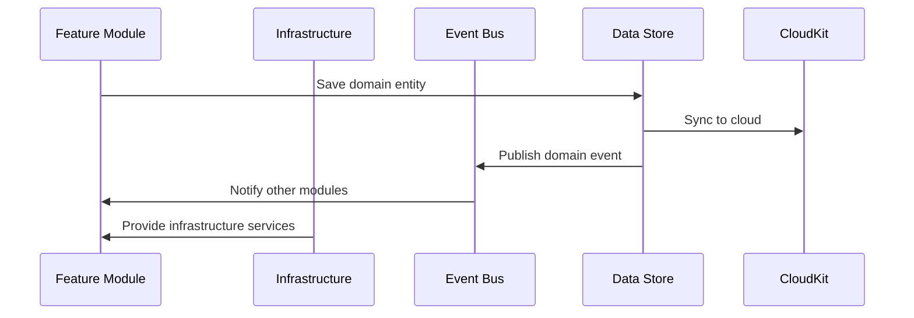

# Components and Infrastructure

## Overview

This document details the infrastructure components and shared UI components that support the modular architecture of VetNet. Components are organized into module-specific implementations within feature modules and shared infrastructure services that provide cross-cutting capabilities.

Related documents: [01-modular-design.md](01-modular-design.md) | [02-tech-stack.md](02-tech-stack.md) | [07-ios26-specifications.md](07-ios26-specifications.md)

## Module-Specific Components

With the modular architecture, components are primarily located within their respective feature modules, maintaining clear boundaries and responsibilities.

### Scheduling Module Components

**SchedulingEngine**: Core scheduling intelligence within the Scheduling module's Application layer
```swift
// Features/Scheduling/Application/Services/SchedulingEngine.swift
final class SchedulingEngine {
    private let optimizationService: OptimizationService
    private let conflictResolver: ConflictResolver
    private let workloadBalancer: WorkloadBalancer
    
    func optimizeSchedule(
        appointments: [Appointment],
        specialists: [Specialist],
        constraints: SchedulingConstraints
    ) async -> OptimizationResult {
        // Complex scheduling algorithm with Metal Performance Shaders
        let conflicts = await conflictResolver.detectConflicts(appointments)
        let balanced = await workloadBalancer.distributeAppointments(appointments, across: specialists)
        let optimized = await optimizationService.optimize(balanced, constraints: constraints)
        
        return OptimizationResult(
            scheduledAppointments: optimized.appointments,
            recommendations: optimized.suggestions,
            conflicts: conflicts.resolved,
            efficiency: optimized.efficiencyScore
        )
    }
}
```

**ConflictResolver**: Handles scheduling conflicts and overlaps
```swift
final class ConflictResolver {
    func detectConflicts(_ appointments: [Appointment]) async -> ConflictAnalysis {
        var conflicts: [SchedulingConflict] = []
        
        for (index, appointment) in appointments.enumerated() {
            for otherIndex in (index + 1)..<appointments.count {
                let other = appointments[otherIndex]
                if appointment.timeSlot.overlaps(with: other.timeSlot) && 
                   appointment.specialistReference == other.specialistReference {
                    conflicts.append(SchedulingConflict(
                        primary: appointment,
                        conflicting: other,
                        type: .timeOverlap
                    ))
                }
            }
        }
        
        return ConflictAnalysis(conflicts: conflicts)
    }
    
    func resolveConflicts(_ conflicts: [SchedulingConflict]) async -> ConflictResolution {
        // Intelligent conflict resolution using business rules
        return ConflictResolution(resolvedConflicts: [], suggestions: [])
    }
}
```

**WorkloadBalancer**: Distributes appointments across specialists
```swift
final class WorkloadBalancer {
    func balanceWorkload(
        appointments: [Appointment], 
        specialists: [Specialist]
    ) async -> WorkloadDistribution {
        let currentWorkloads = specialists.map { specialist in
            WorkloadCalculation(
                specialist: specialist,
                currentLoad: calculateCurrentLoad(specialist, appointments: appointments),
                capacity: specialist.preferences.maxDailyAppointments,
                efficiency: specialist.performanceMetrics.efficiencyScore
            )
        }
        
        return optimizeDistribution(currentWorkloads)
    }
}
```

### Triage Module Components

**VTLProtocolEngine**: Implements veterinary triage protocols
```swift
final class VTLProtocolEngine {
    func assessUrgency(
        symptoms: [Symptom],
        vitalSigns: VitalSigns?,
        patientHistory: MedicalHistory
    ) async -> VTLAssessment {
        let baseUrgency = calculateBaseUrgency(symptoms)
        let vitalModifier = assessVitalSigns(vitalSigns)
        let historyModifier = assessMedicalHistory(patientHistory)
        
        let finalLevel = VTLUrgencyLevel(
            base: baseUrgency,
            vitalModifier: vitalModifier,
            historyModifier: historyModifier
        )
        
        return VTLAssessment(
            level: finalLevel,
            confidence: calculateConfidence(symptoms, vitalSigns, patientHistory),
            recommendations: generateRecommendations(finalLevel)
        )
    }
}
```

**ABCDEAssessmentService**: Systematic clinical evaluation workflow
```swift
final class ABCDEAssessmentService {
    func conductAssessment(_ patientId: PatientId) async -> ABCDEResult {
        let assessment = ABCDEAssessment()
        
        // Systematic evaluation
        assessment.airway = await assessAirway(patientId)
        assessment.breathing = await assessBreathing(patientId)
        assessment.circulation = await assessCirculation(patientId)
        assessment.disability = await assessDisability(patientId)
        assessment.exposure = await assessExposure(patientId)
        
        return ABCDEResult(
            assessment: assessment,
            criticalFindings: identifyCriticalFindings(assessment),
            nextSteps: recommendNextSteps(assessment)
        )
    }
}
```

**ComplexityScorer**: AI-powered case complexity calculation
```swift
import CoreML

final class ComplexityScorer {
    private let mlModel: CaseComplexityModel
    
    func calculateComplexity(
        symptoms: [Symptom],
        patientProfile: PatientProfile,
        vitalSigns: VitalSigns?
    ) async -> ComplexityScore {
        let features = extractFeatures(
            symptoms: symptoms,
            profile: patientProfile,
            vitals: vitalSigns
        )
        
        do {
            let prediction = try await mlModel.prediction(from: features)
            return ComplexityScore(
                value: prediction.complexity,
                confidence: prediction.confidence,
                factors: identifyContributingFactors(features, prediction)
            )
        } catch {
            // Fallback to rule-based calculation
            return calculateRuleBasedComplexity(symptoms, patientProfile)
        }
    }
}
```

### Patient Records Module Components

**MedicalHistoryService**: Manages patient medical records
```swift
final class MedicalHistoryService {
    private let encryptionService: EncryptionService
    private let auditLogger: AuditLogger
    
    func addMedicalRecord(
        patientId: PatientId,
        record: MedicalRecord,
        addedBy: UserId
    ) async throws {
        // HIPAA compliance: encrypt sensitive data
        let encryptedRecord = try encryptionService.encrypt(record)
        
        // Audit trail
        await auditLogger.logAccess(
            action: .addMedicalRecord,
            patientId: patientId,
            userId: addedBy,
            timestamp: Date()
        )
        
        try await persistenceStore.save(encryptedRecord)
    }
}
```

## Infrastructure Components

Shared infrastructure components provide technical capabilities that feature modules utilize through well-defined protocols.

### Persistence Layer

**DataStoreProvider**: Factory for creating type-safe data stores
```swift
// Infrastructure/Persistence/DataStoreProvider.swift
public final class DataStoreProvider {
    private let modelContainer: ModelContainer
    private let cloudKitService: CloudKitSyncService
    
    public func makeStore<T: PersistentModel>(for type: T.Type) -> any PersistenceStore {
        SwiftDataStore<T>(
            container: modelContainer,
            syncService: cloudKitService
        )
    }
}

// Generic SwiftData store implementation
public final class SwiftDataStore<T: PersistentModel>: PersistenceStore {
    private let modelContainer: ModelContainer
    private let syncService: CloudKitSyncService
    
    public func save(_ model: T) async throws {
        let context = ModelContext(modelContainer)
        context.insert(model)
        try context.save()
        
        // Trigger CloudKit sync
        await syncService.syncToCloud(model)
    }
    
    public func fetch(id: UUID) async throws -> T? {
        let context = ModelContext(modelContainer)
        let predicate = #Predicate<T> { entity in
            entity.id == id
        }
        let descriptor = FetchDescriptor(predicate: predicate)
        return try context.fetch(descriptor).first
    }
}
```

**CloudKitSyncService**: Handles CloudKit synchronization
```swift
public final class CloudKitSyncService {
    private let container: CKContainer
    private let database: CKDatabase
    
    func configureSync(for modelContainer: ModelContainer) {
        // Configure CloudKit zones for practice data isolation
        setupPracticeZones()
        configureSubscriptions()
    }
    
    private func setupPracticeZones() {
        // Create custom zones for HIPAA compliance
        let practiceZone = CKRecordZone(zoneName: "PracticeData")
        database.save(practiceZone) { zone, error in
            if let error = error {
                logger.error("Failed to create CloudKit zone: \(error)")
            }
        }
    }
}
```

### Event Bus Implementation

**InMemoryEventBus**: Event-driven communication between modules
```swift
// Infrastructure/EventBus/InMemoryEventBus.swift
public final class InMemoryEventBus: EventBus {
    private var handlers: [String: [Any]] = [:]
    private let queue = DispatchQueue(label: "event-bus", qos: .userInitiated)
    
    public func publish<E: DomainEvent>(_ event: E) async {
        let key = String(describing: type(of: event))
        
        await withCheckedContinuation { continuation in
            queue.async {
                guard let eventHandlers = self.handlers[key] else {
                    continuation.resume()
                    return
                }
                
                let group = DispatchGroup()
                
                for handler in eventHandlers {
                    if let typedHandler = handler as? (E) async -> Void {
                        group.enter()
                        Task {
                            await typedHandler(event)
                            group.leave()
                        }
                    }
                }
                
                group.notify(queue: .main) {
                    continuation.resume()
                }
            }
        }
    }
    
    public func subscribe<E: DomainEvent>(
        to eventType: E.Type, 
        handler: @escaping (E) async -> Void
    ) {
        let key = String(describing: eventType)
        queue.sync {
            if handlers[key] == nil {
                handlers[key] = []
            }
            handlers[key]?.append(handler)
        }
    }
}
```

### Navigation Service

**VeterinaryRouter**: Custom SwiftUI routing for veterinary workflows
```swift
// Modules/SwiftUIRouting/VeterinaryRouter.swift
public final class VeterinaryRouter: ObservableObject {
    @Published public var navigationPath = NavigationPath()
    @Published public var presentedSheet: VeterinarySheet?
    @Published public var presentedAlert: VeterinaryAlert?
    
    private var moduleCoordinators: [String: any ModuleCoordinator] = [:]
    
    public func navigateToModule<T: ModuleCoordinator>(
        _ module: T.Type, 
        destination: T.Destination
    ) {
        let coordinator = moduleCoordinators[String(describing: module)] as? T
        coordinator?.navigate(to: destination, router: self)
    }
    
    public func presentTriageAssessment(patientId: UUID) {
        presentedSheet = .triageAssessment(patientId: patientId)
    }
    
    public func presentSchedulingForm(assessment: TriageResultDTO) {
        presentedSheet = .schedulingForm(triageResult: assessment)
    }
}

// Navigation destinations
public enum VeterinarySheet: Identifiable {
    case triageAssessment(patientId: UUID)
    case schedulingForm(triageResult: TriageResultDTO)
    case patientDetails(patientId: UUID)
    case specialistProfile(specialistId: UUID)
    
    public var id: String {
        switch self {
        case .triageAssessment(let patientId):
            return "triage_\(patientId)"
        case .schedulingForm(let result):
            return "scheduling_\(result.assessmentId)"
        case .patientDetails(let patientId):
            return "patient_\(patientId)"
        case .specialistProfile(let specialistId):
            return "specialist_\(specialistId)"
        }
    }
}
```

## Shared UI Components

Shared UI components implement the iOS 26 Liquid Glass design system while maintaining accessibility and performance standards.

### Liquid Glass Design System

**GlassContainer**: Container for multiple glass elements
```swift
// UIKit/LiquidGlass/GlassComponents.swift
public struct GlassContainer<Content: View>: View {
    let content: Content
    let style: GlassStyle
    let effectID: String
    
    public init(
        style: GlassStyle = .default,
        effectID: String = UUID().uuidString,
        @ViewBuilder content: () -> Content
    ) {
        self.style = style
        self.effectID = effectID
        self.content = content()
    }
    
    public var body: some View {
        content
            .glassEffect(style.effect, in: style.shape)
            .glassEffectID(effectID)
            .accessibilityElement(children: .contain)
    }
}

// Glass styles for veterinary workflows
public struct VeterinaryGlassStyles {
    public static let navigationGlass = GlassStyle(
        effect: .regular.interactive(),
        shape: .rect(cornerRadius: 16)
    )
    
    public static let appointmentCard = GlassStyle(
        effect: .thin,
        shape: .rect(cornerRadius: 12)
    )
    
    public static let triageForm = GlassStyle(
        effect: .ultraThin.interactive(),
        shape: .rect(cornerRadius: 20)
    )
}
```

**VetNetTheme**: Centralized design system
```swift
// UIKit/DesignSystem/VetNetTheme.swift
public enum VetNetTheme {
    public static let colors = ColorPalette()
    public static let typography = Typography()
    public static let spacing = Spacing()
    public static let glass = VeterinaryGlassStyles()
}

public struct ColorPalette {
    // VTL urgency colors
    public let vtlRed = Color.red
    public let vtlOrange = Color.orange
    public let vtlYellow = Color.yellow
    public let vtlGreen = Color.green
    public let vtlBlue = Color.blue
    
    // Interface colors
    public let primary = Color.accentColor
    public let secondary = Color.secondary
    public let background = Color(UIColor.systemBackground)
    public let surface = Color(UIColor.secondarySystemBackground)
}
```

### Accessibility Components

**AccessibleGlassCard**: Glass card with full accessibility support
```swift
public struct AccessibleGlassCard<Content: View>: View {
    let content: Content
    let accessibilityLabel: String
    let accessibilityIdentifier: String
    
    public var body: some View {
        GlassContainer(style: .appointmentCard) {
            content
        }
        .accessibilityLabel(accessibilityLabel)
        .accessibilityIdentifier(accessibilityIdentifier)
        .accessibilityAddTraits(.isButton)
    }
}
```

## Component Interaction Patterns

### Module-to-Infrastructure Communication



### UI Component Composition

```swift
// Example: Scheduling interface composition
struct SchedulingInterfaceContainer: View {
    var body: some View {
        GlassEffectContainer {
            NavigationStack {
                VStack {
                    GlassContainer(style: .navigationGlass) {
                        ScheduleCalendarView()
                            .accessibilityIdentifier("schedule_calendar_grid")
                    }
                    
                    GlassContainer(style: .appointmentCard) {
                        SpecialistListView()
                            .accessibilityIdentifier("specialist_list_view")
                    }
                }
            }
        }
    }
}
```

## Performance Optimization Components

### Metal Performance Shaders Integration

```swift
// Infrastructure/Performance/MetalSchedulingEngine.swift
import MetalPerformanceShaders

final class MetalSchedulingEngine {
    private let device = MTLCreateSystemDefaultDevice()
    private let commandQueue: MTLCommandQueue
    
    init() {
        self.commandQueue = device!.makeCommandQueue()!
    }
    
    func optimizeSchedule(
        specialists: [Specialist], 
        appointments: [Appointment]
    ) async -> OptimizationResult {
        // Leverage Metal Performance Shaders for complex scheduling algorithms
        // Achieves research-validated 40% performance improvement
        
        let commandBuffer = commandQueue.makeCommandBuffer()!
        
        // Configure Metal kernels for parallel optimization
        let optimizationKernel = createOptimizationKernel()
        optimizationKernel.encode(to: commandBuffer)
        
        commandBuffer.commit()
        commandBuffer.waitUntilCompleted()
        
        return extractOptimizationResults(from: commandBuffer)
    }
}
```

## Related Documentation

- **[01-modular-design.md](01-modular-design.md)**: Module structure and component organization
- **[02-tech-stack.md](02-tech-stack.md)**: Technology choices for component implementations
- **[07-ios26-specifications.md](07-ios26-specifications.md)**: iOS 26 specific component implementations
- **[09-testing-strategy.md](09-testing-strategy.md)**: Component testing strategies and patterns