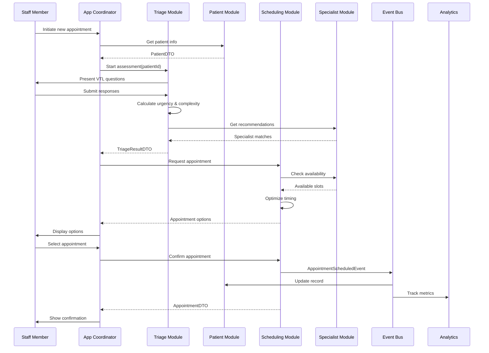

# Core Workflows and Business Processes

## Overview

This document details the core business workflows and processes within the VetNet application, showing how feature modules interact to deliver complete veterinary practice workflows. Each workflow demonstrates the modular architecture in action with clear inter-module communication patterns.

Related documents: [01-modular-design.md](01-modular-design.md) | [03-feature-modules.md](03-feature-modules.md) | [05-components.md](05-components.md)

## Modular Appointment Scheduling Workflow

The primary workflow demonstrates how multiple feature modules collaborate to deliver intelligent appointment scheduling from initial triage through final confirmation.

### Workflow Overview



### Detailed Workflow Steps

#### Phase 1: Patient Identification and Triage Initiation

**Step 1: Patient Selection**
```swift
// App Coordinator initiates workflow
func initiateNewAppointment() async {
    // Present patient search interface
    let selectedPatient = await patientModule.presentPatientSelector()
    
    // Start triage assessment
    await triageModule.startAssessment(for: selectedPatient.id)
}
```

**Step 2: Retrieve Patient Context**
```swift
// Patient Module provides context
public func getPatientContext(_ patientId: UUID) async -> PatientContextDTO {
    let patient = try await getPatient(patientId)
    let medicalHistory = try await getMedicalHistory(patientId)
    let recentVisits = try await getRecentVisits(patientId, limit: 5)
    
    return PatientContextDTO(
        patient: patient,
        medicalHistory: medicalHistory.summary,
        recentVisits: recentVisits,
        riskFactors: identifyRiskFactors(medicalHistory)
    )
}
```

#### Phase 2: VTL Triage Assessment

**Step 3: Present VTL Assessment Interface**
```swift
// Triage Module presents assessment form
public func startAssessment(for patientId: UUID) async -> AssessmentSessionDTO {
    let patientContext = await patientModule.getPatientContext(patientId)
    let assessmentSession = createAssessmentSession(patientContext)
    
    // Present dynamic QuickForm based on species and history
    let vtlQuestions = generateVTLQuestions(
        species: patientContext.patient.species,
        medicalHistory: patientContext.medicalHistory
    )
    
    return AssessmentSessionDTO(
        sessionId: assessmentSession.id,
        questions: vtlQuestions,
        patientContext: patientContext
    )
}
```

**Step 4: Process Assessment Responses**
```swift
// Triage Module processes responses and calculates urgency
public func submitAssessment(_ submission: TriageSubmissionDTO) async -> TriageResultDTO {
    // Apply VTL protocols
    let vtlLevel = vtlProtocolEngine.assessUrgency(
        symptoms: submission.symptoms,
        vitalSigns: submission.vitalSigns,
        responses: submission.responses
    )
    
    // Calculate case complexity using AI
    let complexityScore = await complexityScorer.calculateComplexity(
        symptoms: submission.symptoms,
        patientProfile: submission.patientContext,
        vitalSigns: submission.vitalSigns
    )
    
    // Generate specialist recommendations
    let specialistRecommendations = await specialistRecommender.recommend(
        vtlLevel: vtlLevel,
        complexity: complexityScore,
        symptoms: submission.symptoms
    )
    
    return TriageResultDTO(
        assessmentId: submission.sessionId,
        vtlLevel: vtlLevel.rawValue,
        complexityScore: complexityScore.value,
        recommendedSpecialists: specialistRecommendations.map(\.specialistId),
        urgentCare: vtlLevel.requiresUrgentCare,
        maxWaitTime: vtlLevel.maxWaitTime
    )
}
```

#### Phase 3: Specialist Matching and Availability

**Step 5: Find Optimal Specialists**
```swift
// Specialist Module finds best matches
public func findOptimalSpecialists(
    for assessment: TriageResultDTO
) async -> [SpecialistMatchDTO] {
    let allSpecialists = await getAllActiveSpecialists()
    
    let matches = await withTaskGroup(of: SpecialistMatchDTO?.self) { group in\n        for specialist in allSpecialists {\n            group.addTask {\n                await self.evaluateSpecialistMatch(specialist, assessment: assessment)\n            }\n        }\n        \n        var results: [SpecialistMatchDTO] = []\n        for await match in group {\n            if let match = match {\n                results.append(match)\n            }\n        }\n        return results.sorted { $0.matchScore > $1.matchScore }\n    }\n    \n    return Array(matches.prefix(5)) // Top 5 matches\n}\n\nprivate func evaluateSpecialistMatch(\n    _ specialist: Specialist,\n    assessment: TriageResultDTO\n) async -> SpecialistMatchDTO? {\n    // Check expertise alignment\n    let expertiseScore = calculateExpertiseMatch(specialist, assessment)\n    guard expertiseScore > 0.6 else { return nil }\n    \n    // Check availability\n    let availability = await getSpecialistAvailability(specialist.id)\n    guard !availability.isEmpty else { return nil }\n    \n    // Check workload balance\n    let workloadScore = calculateWorkloadScore(specialist)\n    \n    let overallScore = (expertiseScore * 0.5) + (workloadScore * 0.3) + (availability.count * 0.2)\n    \n    return SpecialistMatchDTO(\n        specialistId: specialist.id,\n        matchScore: overallScore,\n        expertiseAlignment: expertiseScore,\n        availableSlots: availability,\n        estimatedWaitTime: calculateEstimatedWaitTime(specialist)\n    )\n}\n```

#### Phase 4: Scheduling Optimization

**Step 6: Generate Scheduling Options**
```swift\n// Scheduling Module creates optimal appointment options\npublic func generateSchedulingOptions(\n    _ request: SchedulingRequestDTO\n) async -> SchedulingOptionsDTO {\n    let specialists = request.preferredSpecialists\n    let urgencyLevel = VTLUrgencyLevel(rawValue: request.vtlLevel)!\n    \n    let options = await withTaskGroup(of: AppointmentOption.self) { group in\n        for specialist in specialists {\n            group.addTask {\n                await self.createOptimalOption(\n                    specialist: specialist,\n                    urgency: urgencyLevel,\n                    duration: request.estimatedDuration\n                )\n            }\n        }\n        \n        var results: [AppointmentOption] = []\n        for await option in group {\n            results.append(option)\n        }\n        return results.sorted { $0.priority > $1.priority }\n    }\n    \n    return SchedulingOptionsDTO(\n        options: options,\n        recommendedOption: options.first,\n        alternativeSlots: generateAlternativeSlots(options)\n    )\n}\n\nprivate func createOptimalOption(\n    specialist: SpecialistMatchDTO,\n    urgency: VTLUrgencyLevel,\n    duration: TimeInterval\n) async -> AppointmentOption {\n    let availableSlots = specialist.availableSlots\n    let urgencyConstraint = urgency.maxWaitTime\n    \n    // Find slots that meet urgency requirements\n    let urgentSlots = availableSlots.filter { slot in\n        slot.start.timeIntervalSinceNow <= urgencyConstraint\n    }\n    \n    let optimalSlot = urgentSlots.first ?? availableSlots.first!\n    \n    return AppointmentOption(\n        specialist: specialist,\n        timeSlot: optimalSlot,\n        priority: calculatePriority(urgency, specialist.matchScore),\n        conflicts: await detectPotentialConflicts(optimalSlot),\n        estimatedDuration: duration\n    )\n}\n```\n\n#### Phase 5: Appointment Confirmation and Event Publishing\n\n**Step 7: Confirm Appointment**\n```swift\n// Scheduling Module confirms and persists appointment\npublic func confirmAppointment(\n    _ request: AppointmentConfirmationDTO\n) async throws -> AppointmentDTO {\n    // Create appointment entity\n    let appointment = Appointment(\n        scheduledDateTime: request.selectedSlot.start,\n        estimatedDuration: request.estimatedDuration,\n        type: request.appointmentType\n    )\n    appointment.patient = await getPatient(request.patientId)\n    appointment.specialist = await getSpecialist(request.specialistId)\n    appointment.triageAssessmentID = request.triageAssessmentId\n    \n    // Save with conflict detection\n    try await persistenceStore.save(appointment)\n    \n    // Publish domain event\n    let event = AppointmentScheduledEvent(\n        appointmentId: appointment.appointmentID,\n        patientId: request.patientId,\n        specialistId: request.specialistId,\n        scheduledTime: request.selectedSlot.start,\n        vtlLevel: VTLUrgencyLevel(rawValue: request.vtlLevel)!\n    )\n    await eventBus.publish(event)\n    \n    return appointment.toDTO()\n}\n```\n\n## Emergency Triage Fast-Track Workflow\n\nFor critical cases (VTL Red/Orange), a streamlined workflow bypasses standard scheduling optimization.\n\n### Emergency Workflow\n\n```mermaid\nsequenceDiagram\n    participant Staff as Emergency Staff\n    participant Triage as Triage Module\n    participant Schedule as Scheduling Module\n    participant Specialist as Specialist Module\n    participant Alert as Alert System\n    \n    Staff->>Triage: Emergency assessment\n    Triage->>Triage: Identify VTL Red/Orange\n    Triage->>Alert: Trigger emergency alert\n    Alert->>Specialist: Notify available specialists\n    Triage->>Schedule: Request immediate slot\n    Schedule->>Schedule: Override normal scheduling\n    Schedule->>Specialist: Get emergency availability\n    Specialist-->>Schedule: Immediate availability\n    Schedule-->>Triage: Emergency slot confirmed\n    Triage-->>Staff: Emergency appointment ready\n    Alert->>Staff: Specialist en route notification\n```\n\n### Emergency Logic\n\n```swift\n// Emergency fast-track for critical cases\npublic func handleEmergencyCase(_ assessment: TriageResultDTO) async {\n    guard assessment.vtlLevel <= 2 else { return } // Red or Orange only\n    \n    // Immediate specialist notification\n    let emergencySpecialists = await findEmergencySpecialists()\n    await notificationService.sendEmergencyAlert(\n        specialists: emergencySpecialists,\n        assessment: assessment\n    )\n    \n    // Override normal scheduling constraints\n    let emergencySlot = await schedulingModule.createEmergencySlot(\n        assessment: assessment,\n        specialists: emergencySpecialists\n    )\n    \n    // Auto-confirm emergency appointment\n    let appointment = try await schedulingModule.confirmEmergencyAppointment(\n        slot: emergencySlot,\n        assessment: assessment\n    )\n    \n    // Real-time updates to staff\n    await notificationService.notifyEmergencyTeam(appointment)\n}\n```\n\n## Patient Check-In and Update Workflow\n\nHandles patient arrival and real-time appointment updates.\n\n### Check-In Process\n\n```mermaid\nsequenceDiagram\n    participant Patient as Patient/Owner\n    participant Staff as Front Desk\n    participant Records as Patient Module\n    participant Schedule as Scheduling Module\n    participant Specialist as Specialist Module\n    participant Analytics as Analytics Module\n    \n    Patient->>Staff: Arrive for appointment\n    Staff->>Schedule: Check-in patient\n    Schedule->>Records: Update patient status\n    Records->>Records: Verify patient info\n    Records->>Staff: Show patient summary\n    Staff->>Schedule: Confirm check-in\n    Schedule->>Specialist: Notify of arrival\n    Schedule->>Analytics: Log arrival time\n    Specialist->>Staff: Ready for patient\n```\n\n## Appointment Completion and Follow-Up Workflow\n\nManages appointment completion, outcome recording, and follow-up scheduling.\n\n### Completion Workflow\n\n```mermaid\nsequenceDiagram\n    participant Specialist as Veterinary Specialist\n    participant Records as Patient Module\n    participant Schedule as Scheduling Module\n    participant Analytics as Analytics Module\n    participant Billing as External Billing\n    \n    Specialist->>Records: Add treatment notes\n    Records->>Records: Update medical history\n    Specialist->>Schedule: Mark appointment complete\n    Schedule->>Schedule: Record actual duration\n    Schedule->>Analytics: Send completion metrics\n    Schedule->>Billing: Trigger billing process\n    \n    alt Follow-up Required\n        Specialist->>Schedule: Schedule follow-up\n        Schedule->>Records: Link follow-up to treatment\n    end\n    \n    Analytics->>Analytics: Update specialist performance\n    Analytics->>Analytics: Update practice metrics\n```\n\n## Cross-Module Data Flow Patterns\n\n### Data Transformation Pipeline\n\n```mermaid\ngraph LR\n    subgraph \"Triage Module\"\n        TD[Triage Domain Model]\n        TU[Triage Use Case]\n        TDTO[TriageDTO]\n    end\n    \n    subgraph \"Patient Module\"\n        PD[Patient Domain Model]\n        PU[Patient Use Case]\n        PDTO[PatientDTO]\n    end\n    \n    subgraph \"Scheduling Module\"\n        SD[Schedule Domain Model]\n        SU[Schedule Use Case]\n        SDTO[ScheduleDTO]\n    end\n    \n    subgraph \"Infrastructure\"\n        DB[(SwiftData)]\n        EB{{Event Bus}}\n    end\n    \n    TU -->|Query| PDTO\n    PU -->|Return| PDTO\n    TU -->|Create| TDTO\n    TU -->|Request| SDTO\n    SU -->|Return| SDTO\n    \n    TD -.->|Map| TDTO\n    PD -.->|Map| PDTO\n    SD -.->|Map| SDTO\n    \n    SU -->|Persist| DB\n    SU -->|Publish| EB\n    EB -->|Notify| PU\n    \n    style TD fill:#FFE4B5\n    style PD fill:#E6E6FA\n    style SD fill:#ADD8E6\n```\n\n## Workflow Error Handling\n\n### Error Recovery Patterns\n\n```swift\n// Robust error handling in critical workflows\nfunc executeAppointmentWorkflow(\n    patientId: UUID\n) async -> Result<AppointmentDTO, WorkflowError> {\n    do {\n        // Step 1: Patient context (can fail)\n        let patientContext = try await patientModule.getPatientContext(patientId)\n        \n        // Step 2: Triage assessment (can fail)\n        let assessmentSession = try await triageModule.startAssessment(for: patientId)\n        \n        // Wait for user input...\n        let triageResult = try await triageModule.awaitAssessmentCompletion(assessmentSession.sessionId)\n        \n        // Step 3: Specialist matching (graceful degradation)\n        let specialists = await specialistModule.findOptimalSpecialists(for: triageResult)\n        guard !specialists.isEmpty else {\n            // Fallback: show all available specialists\n            let allSpecialists = await specialistModule.getAllAvailableSpecialists()\n            return await proceedWithSpecialists(allSpecialists, triageResult: triageResult)\n        }\n        \n        // Step 4: Scheduling (can fail with conflicts)\n        let appointment = try await schedulingModule.createOptimalAppointment(\n            triageResult: triageResult,\n            preferredSpecialists: specialists\n        )\n        \n        return .success(appointment)\n        \n    } catch WorkflowError.patientNotFound {\n        return .failure(.patientNotFound)\n    } catch WorkflowError.triageIncomplete {\n        return .failure(.triageIncomplete)\n    } catch WorkflowError.noAvailableSpecialists {\n        return .failure(.noAvailableSpecialists)\n    } catch WorkflowError.schedulingConflict(let conflicts) {\n        // Attempt automatic conflict resolution\n        let resolved = try await schedulingModule.resolveConflicts(conflicts)\n        return .success(resolved)\n    } catch {\n        return .failure(.unknownError(error))\n    }\n}\n```\n\n## Performance-Optimized Workflow Execution\n\n### Parallel Processing Patterns\n\n```swift\n// Optimize workflow performance with structured concurrency\nfunc executeParallelWorkflowSteps(\n    assessment: TriageResultDTO\n) async -> WorkflowResult {\n    async let specialists = specialistModule.findOptimalSpecialists(for: assessment)\n    async let patientHistory = patientModule.getDetailedHistory(assessment.patientId)\n    async let availableSlots = schedulingModule.getAvailableSlots(\n        urgency: assessment.vtlLevel,\n        duration: assessment.estimatedDuration\n    )\n    \n    // All tasks execute in parallel\n    let (specialistMatches, history, slots) = await (specialists, patientHistory, availableSlots)\n    \n    // Combine results for optimal scheduling\n    return WorkflowResult(\n        specialists: specialistMatches,\n        patientHistory: history,\n        availableSlots: slots,\n        recommendations: generateRecommendations(specialistMatches, history, slots)\n    )\n}\n```\n\n## Workflow Analytics and Monitoring\n\n### Workflow Performance Tracking\n\n```swift\n// Track workflow performance for optimization\nstruct WorkflowMetrics {\n    let startTime: Date\n    let completionTime: Date?\n    let steps: [WorkflowStep]\n    let errors: [WorkflowError]\n    \n    var totalDuration: TimeInterval? {\n        guard let completionTime = completionTime else { return nil }\n        return completionTime.timeIntervalSince(startTime)\n    }\n    \n    var bottlenecks: [WorkflowBottleneck] {\n        return steps.compactMap { step in\n            guard step.duration > step.expectedDuration * 1.5 else { return nil }\n            return WorkflowBottleneck(\n                step: step.name,\n                actualDuration: step.duration,\n                expectedDuration: step.expectedDuration\n            )\n        }\n    }\n}\n\n// Analytics module tracks workflow performance\nfunc trackWorkflowCompletion(_ metrics: WorkflowMetrics) async {\n    await analyticsModule.recordWorkflowMetrics(metrics)\n    \n    // Alert on performance degradation\n    if let totalDuration = metrics.totalDuration,\n       totalDuration > expectedWorkflowDuration * 1.3 {\n        await alertingService.sendPerformanceAlert(\n            workflow: \"appointment_scheduling\",\n            actualDuration: totalDuration,\n            expectedDuration: expectedWorkflowDuration\n        )\n    }\n}\n```\n\n## Related Documentation\n\n- **[03-feature-modules.md](03-feature-modules.md)**: Detailed module interfaces used in workflows\n- **[01-modular-design.md](01-modular-design.md)**: Inter-module communication patterns\n- **[05-components.md](05-components.md)**: Component implementations supporting workflows\n- **[08-security-performance.md](08-security-performance.md)**: Security considerations in workflow execution