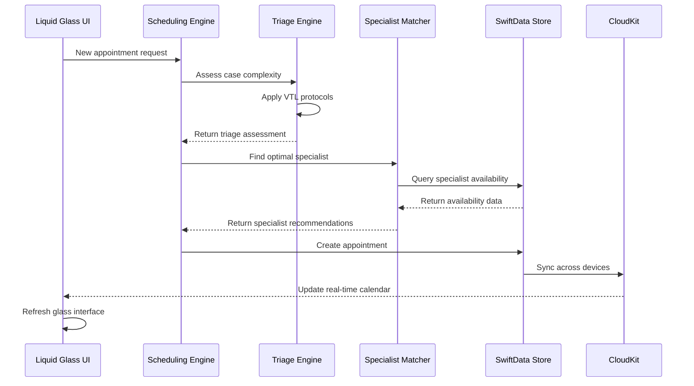

# Component Interaction Diagram

```mermaid
sequenceDiagram
    participant UI as Liquid Glass UI
    participant SE as Scheduling Engine
    participant TE as Triage Engine
    participant SM as Specialist Matcher
    participant SD as SwiftData Store
    participant CK as CloudKit
    
    UI->>SE: New appointment request
    SE->>TE: Assess case complexity
    TE->>TE: Apply VTL protocols
    TE-->>SE: Return triage assessment
    SE->>SM: Find optimal specialist
    SM->>SD: Query specialist availability
    SD-->>SM: Return availability data
    SM-->>SE: Return specialist recommendations
    SE->>SD: Create appointment
    SD->>CK: Sync across devices
    CK-->>UI: Update real-time calendar
    UI->>UI: Refresh glass interface
```
