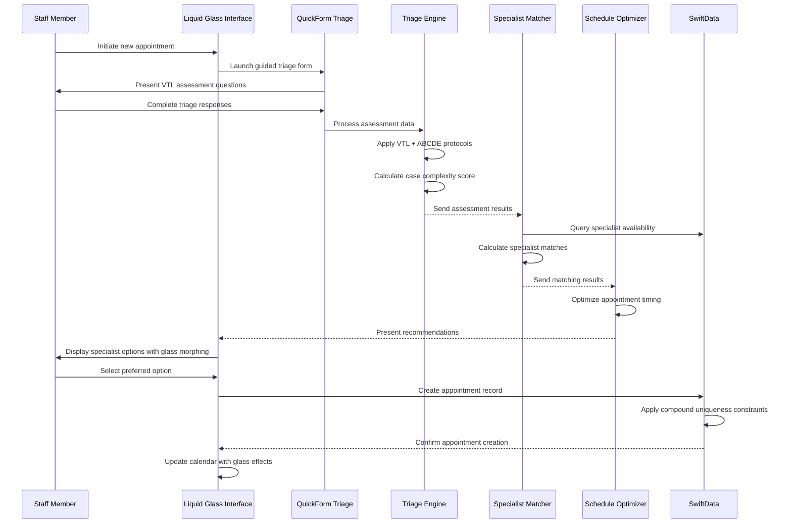

# Core Workflows

## Intelligent Appointment Scheduling Workflow

```mermaid
sequenceDiagram
    participant S as Staff Member
    participant UI as Liquid Glass Interface
    participant QF as QuickForm Triage
    participant TE as Triage Engine
    participant SM as Specialist Matcher
    participant SO as Schedule Optimizer
    participant SD as SwiftData
    
    S->>UI: Initiate new appointment
    UI->>QF: Launch guided triage form
    QF->>S: Present VTL assessment questions
    S->>QF: Complete triage responses
    QF->>TE: Process assessment data
    TE->>TE: Apply VTL + ABCDE protocols
    TE->>TE: Calculate case complexity score
    TE-->>SM: Send assessment results
    SM->>SD: Query specialist availability
    SM->>SM: Calculate specialist matches
    SM-->>SO: Send matching results
    SO->>SO: Optimize appointment timing
    SO-->>UI: Present recommendations
    UI->>S: Display specialist options with glass morphing
    S->>UI: Select preferred option
    UI->>SD: Create appointment record
    SD->>SD: Apply compound uniqueness constraints
    SD-->>UI: Confirm appointment creation
    UI->>UI: Update calendar with glass effects
```
