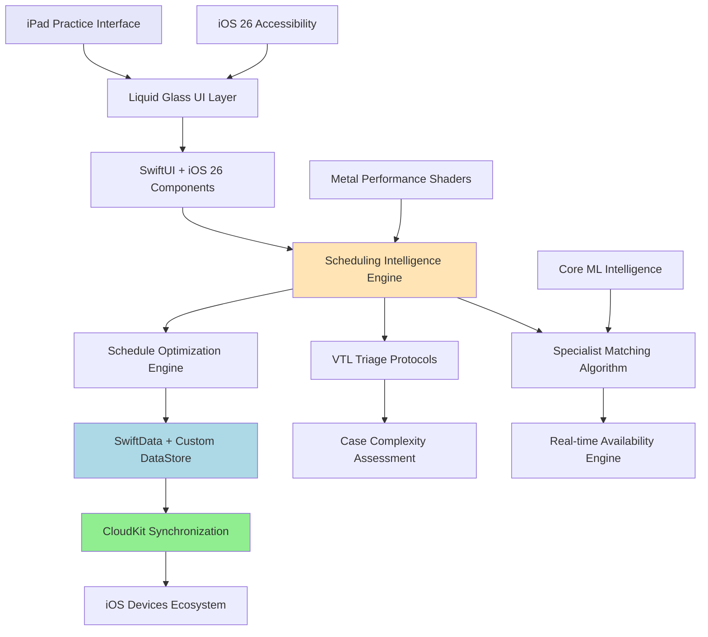

# High Level Architecture

## Technical Summary

The Veterinary Practice Intelligence application employs a modern iOS 26-native architecture utilizing Swift 6.2+ structured concurrency, SwiftData with custom DataStore protocols, and Liquid Glass design system for premium user experience. The system implements intelligent scheduling algorithms with VTL protocol integration, real-time multi-device synchronization, and Metal Performance Shaders optimization for complex calendar interfaces.

Key architectural decisions center on leveraging iOS 26's 40% GPU performance improvements and unified cross-platform design language while implementing sophisticated veterinary workflow intelligence through specialist matching algorithms and case complexity assessment.

## Platform and Infrastructure Choice

**Platform Decision**: **iOS 26+ Native Ecosystem**

**Primary Platform**: iPadOS 26+ optimized for veterinary practice iPad Pro workflows
**Secondary Platforms**: iOS 26+ (mobile companion), macOS 26+ (administrative oversight)
**Infrastructure**: CloudKit for seamless Apple ecosystem integration with HIPAA-compliant data handling

**Key Services Utilized**:
- **CloudKit**: Primary cloud synchronization and storage with veterinary data encryption
- **Apple Sign-In**: Practice-level authentication with role-based access control
- **Core ML + Metal Performance Shaders**: AI-powered scheduling optimization with hardware acceleration
- **iOS 26 Accessibility Services**: System-wide Accessibility Reader and enhanced VoiceOver integration

**Deployment Strategy**: 
- **App Store Distribution**: Premium veterinary market through Apple Business Manager
- **Enterprise Deployment**: Direct distribution for large veterinary practice networks
- **Cross-Platform Sync**: Automatic device synchronization through CloudKit infrastructure

## Repository Structure

**Approach**: **iOS Monorepo with Modular Package Architecture**

**Rationale**: Single repository optimized for iOS ecosystem development with clear module boundaries supporting future expansion while maintaining Swift Package Manager integration

```
VeterinaryPracticeApp/
├── VeterinaryPracticeApp/          # Main iOS application target
├── VeterinaryCore/                 # Core business logic Swift package
├── VeterinaryUI/                   # Liquid Glass UI components package
├── SchedulingEngine/               # Intelligent scheduling algorithms package
├── TriageProtocols/               # VTL and medical assessment protocols package
├── DataModels/                    # SwiftData models and persistence layer
└── Testing/                       # Shared testing utilities and mocks
```

## High Level Architecture Diagram



## Architectural Patterns

**iOS 26 + SwiftUI MVVM with Intelligent Scheduling**
- **Pattern**: Model-View-ViewModel optimized for SwiftUI @Observable and iOS 26 Liquid Glass components
- **Rationale**: Leverages iOS 26 performance improvements while maintaining clear separation between scheduling intelligence and user interface

**Dependency Injection with Factory Pattern**
- **Pattern**: Factory-based dependency injection for testable architecture and clear service boundaries
- **Rationale**: Enables comprehensive testing of scheduling algorithms and seamless integration with Mockable for service layer validation

**Command Pattern for Scheduling Operations**
- **Pattern**: Command-based scheduling actions with undo/redo support for appointment management
- **Rationale**: Supports complex scheduling scenarios, conflict resolution, and audit trail requirements for medical software compliance

**Observer Pattern with Combine + SwiftData**
- **Pattern**: Reactive data flow using Combine publishers with SwiftData @Query integration for real-time updates
- **Rationale**: Ensures immediate UI updates across devices when appointments, specialist availability, or patient information changes

**Strategy Pattern for Triage Protocols**
- **Pattern**: Pluggable triage assessment strategies (VTL, ABCDE, custom protocols) with consistent interface
- **Rationale**: Allows adaptation to different veterinary practice protocols while maintaining core scheduling intelligence
